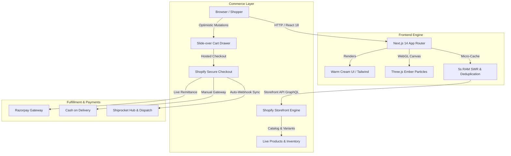

<div align="center">

  

  <br />

  <p align="center">
    <strong>An artisanal, high-performance headless e-commerce storefront for luxury Indian botanical scented candles.</strong><br />
    Handcrafted with Next.js 14 App Router, Shopify Storefront GraphQL, Three.js, and Framer Motion.
  </p>

  <p align="center">
    <a href="https://nextjs.org"></a>
    <a href="https://shopify.dev/docs/api/storefront"></a>
    <a href="https://threejs.org"></a>
    <a href="https://tailwindcss.com"></a>
    <a href="https://www.typescriptlang.org"></a>
  </p>

  

</div>

---

## 🌟 Overview

**MOAMLIGHT** is a flagship headless direct-to-consumer (D2C) e-commerce storefront engineered for an Indian luxury botanical candle atelier. The platform pairs bespoke editorial storytelling with sub-millisecond client performance, powered by Next.js 14 Server Components and Shopify's Storefront GraphQL API.

### 🕯️ Core Experience Pillars
- **Warm Artisanal Aesthetic**: Unified `#FAF7F2` warm linen palette, matte charcoal typography, amber gold highlights, and responsive typography featuring *Cormorant Garamond* and *Plus Jakarta Sans*.
- **Atmospheric Particle Physics**: An interactive WebGL ember engine built with `@react-three/fiber` and `Three.js` simulating gentle rising candle embers without main-thread blocking.
- **Headless Shopify Architecture**: 100% decoupled from liquid templates. Dynamic catalog fetching, GraphQL variant selections, optimistic sliding cart drawer, and hosted checkout handoff.
- **Shopify New Customer Accounts**: Frictionless 1-click passwordless customer authentication via mobile/email OTP.
- **Indian D2C Logistics Suite**: Integrated Cash on Delivery (COD) workflows, automated order remittance, and Shiprocket domestic fulfillment integration.

<div align="center">
  
</div>

---

## ⚡ Architectural Blueprint



<div align="center">
  
</div>

---

## ✨ Flagship Capabilities

### 1. 🛍️ Headless Shopify Catalog Sync
- **Live Variant Selection**: Dynamic resolution of 200g single-wick and 450g double-wick candle weights with real-time pricing updates.
- **Inventory Safety**: Leverages GraphQL `availableForSale` checks, preventing stale-stock checkouts without requiring restricted inventory permissions.
- **Micro-Cached Fast Transitions**: Built with a custom 5-second in-memory SWR cache (`React.cache()` deduplicated) cutting page-load times to sub-millisecond ranges.

### 2. 🎨 Atmospheric Three.js Ember Engine
- Custom WebGL particle canvas in `FloatingEmbers.tsx` rendering rising golden embers.
- Optimized buffer geometries and adaptive particle density to ensure steady 60 FPS on mobile and low-power devices.

### 3. 🔐 Modern Customer Portal (OTP Login)
- Integrated directly with Shopify's New Customer Accounts infrastructure (`https://shopify.com/<store-id>/account`).
- Desktop Header profile badge, slide-over mobile drawer link, and footer direct access.
- Eliminates password fatigue by providing instant email/SMS one-time password verification.

### 4. 🇮🇳 Indian D2C Checkout & Fulfillment
- **Cash on Delivery (COD)**: First-class manual payment support with automated status notifications.
- **Shiprocket Integration**: Configured pickup hub and automated tracking consignment links for shoppers.
- **Razorpay Integration**: Configured and awaiting standard banking verification for live UPI, RuPay, and Cards.

<div align="center">
  
</div>

---

## 🛠️ Technology Stack

| Layer | Technologies |
| :--- | :--- |
| **Framework** | [Next.js 14](https://nextjs.org/) (App Router, Server Actions, Route Handlers) |
| **Core** | [React 18](https://react.dev/), [TypeScript 5.6](https://www.typescriptlang.org/) |
| **Styling** | [Tailwind CSS 3.4](https://tailwindcss.com/), PostCSS, Custom Design Tokens |
| **Animation & 3D** | [Three.js](https://threejs.org/), [@react-three/fiber](https://docs.pmnd.rs/react-three-fiber), [Framer Motion](https://www.framer.com/motion/), [GSAP](https://gsap.com/) |
| **E-Commerce Backend**| [Shopify Storefront API](https://shopify.dev/docs/api/storefront) (GraphQL 2024-07) |
| **Icons & Typography** | [Lucide React](https://lucide.dev/), Cormorant Garamond, Plus Jakarta Sans |
| **Logistics & Payments**| Shiprocket, Razorpay, Shopify Hosted Checkout |

---

## 📂 Project Structure

```text
MOAMLIGHT/
├── app/                        # Next.js 14 App Router
│   ├── layout.tsx              # Root layout, Google fonts, Cart Provider
│   ├── page.tsx                # Homepage (Hero, Scent Explorer, Bestsellers)
│   ├── products/
│   │   ├── page.tsx            # Full Catalog page with dynamic filtering
│   │   └── [id]/page.tsx       # Product Detail Page (PDP) with scent notes
│   ├── cart/                   # Dedicated cart review
│   └── api/                    # Route handlers & ISR revalidation hooks
├── assets/                     # Animated SVGs, branding, and hero banners
│   ├── moamlight-banner.svg    # Animated candle flame & gold shimmer banner
│   └── divider.svg             # Animated golden pulse divider
├── components/                 # Modular design system
│   ├── home/                   # HeroSection, ScentExplorer, BestsellerGrid
│   ├── product/                # ProductCard, ImageGallery, VariantSelector
│   ├── cart/                   # CartDrawer, CartItem, CheckoutButton
│   ├── layout/                 # Centered Header, NavigationDrawer, Footer
│   └── ui/                     # FloatingEmbers (Three.js), Buttons, Modals
├── context/                    # Cart & customer state management
├── lib/                        # Utility functions, price formatters, cn helper
├── src/integrations/shopify/   # Shopify GraphQL queries, client, and types
├── tailwind.config.js          # Custom luxury color palette & typography
└── .env.example                # Sample environment variables
```

---

## 🚀 Getting Started

### 1. Clone the Repository
```bash
git clone https://github.com/Snehil208001/MOAMLIGHT.git
cd MOAMLIGHT
```

### 2. Install Dependencies
```bash
npm install
```

### 3. Configure Environment Variables
Copy `.env.example` to create your local environment file:
```bash
cp .env.example .env.local
```

Populate the required credentials in `.env.local`:
```env
NEXT_PUBLIC_SITE_URL=http://localhost:3000
NEXT_PUBLIC_SHOPIFY_STORE_DOMAIN=your-store.myshopify.com
NEXT_PUBLIC_SHOPIFY_STOREFRONT_ACCESS_TOKEN=your_public_storefront_token
SHOPIFY_STOREFRONT_API_VERSION=2024-07
SHOPIFY_REVALIDATION_SECRET=your_webhook_secret
```

> **Note**: If `NEXT_PUBLIC_SHOPIFY_STORE_DOMAIN` is omitted, the application automatically falls back to curated mock data in `data/products.ts`.

### 4. Run Development Server
```bash
npm run dev
```
Open [http://localhost:3000](http://localhost:3000) to view the storefront.

### 5. Build for Production
```bash
npm run build
npm run start
```

---

## 🔒 Security & Best Practices

- **Zero Secret Leakage**: Admin access tokens and private credentials are kept strictly out of git via `.gitignore`.
- **Read-Only Storefront Token**: The frontend uses Shopify's public Storefront token, scoped solely to catalog fetching and cart mutation.
- **Server-Side Sanitization**: Scent story HTML descriptions from external catalog feeds are sanitized before DOM rendering.

---

## 📄 License

This project is licensed under the [MIT License](LICENSE).

<div align="center">
  <br />
  <p>Crafted with care for <strong>MOAMLIGHT</strong> 🕯️</p>
</div>
