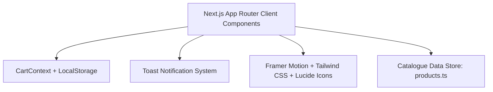

# MOAMLIGHT Storefront Architectural Specification
**Brand**: MOAMLIGHT (Handcrafted Indian D2C Luxury Scented Candles)  
**Document Version**: 1.0.0  
**Status**: Ready for Implementation  
**Tech Stack**: Next.js 14+ (App Router), React 18/19, TypeScript, Tailwind CSS, Framer Motion, Lucide React  

---

## 1. Executive Summary & Brand Identity

### 1.1 Brand Positioning & Ethos
**MOAMLIGHT** is an artisanal Indian Direct-to-Consumer (D2C) home fragrance and luxury scented candle house. Handcrafted with 100% natural, slow-burning botanical soy wax and therapeutic-grade essential oil blends, MOAMLIGHT evokes timeless Indian botanical sanctuaries, royal heritage spices, and grounded mindful living.

* **Core Narrative**: *"Illuminate Your Sanctuary"* — transforming urban sanctuaries into meditative, sensorial retreats through the poetry of light, flame, and slow-perfumery.
* **Product Pillars**:
  1. **Clean Botanical Burn**: 100% biodegradable golden soy wax, free from paraffin, phthalates, and synthetic parabens.
  2. **Artisanal Heritage**: Hand-poured in micro-batches with lead-free dual braided cotton wicks.
  3. **Evocative Indian Olfactive Signatures**: Modern reinterpretations of Mysore sandalwood, Kashmir saffron, Malabar spices, Darjeeling estates, Madurai mogra, and Monsoon mitti/vetiver.
  4. **Sustainable Earth Luxury**: Reusable ceramic and amber glass vessels, zero-plastic unboxing, and recyclable seed-paper dust covers.

### 1.2 Target Audience & Market Dynamics (India D2C)
* **Demographic**: Affluent urban consumers (ages 24–45) in Tier 1 & Tier 2 Indian metros (Bengaluru, Mumbai, Delhi NCR, Pune, Hyderabad, Chennai, Kolkata, Jaipur).
* **Consumer Psyche**: Design-conscious homemakers, luxury lifestyle enthusiasts, self-care practitioners, and premium festive/wedding gifters.
* **Indian E-Commerce Imperatives**:
  * **Cash on Delivery (COD)**: High conversion driver; must be prominently highlighted on PDP and Cart.
  * **Trust & Security**: Clear free shipping thresholds (₹999+), hassle-free replacement guarantees for transit breakage, and estimated pincode delivery dates.
  * **Festival & Gifting Culture**: Frictionless gifting add-ons (handwritten personalized notes, luxury rigid boxes, gift wrap).

---

## 2. Design System & Aesthetic Architecture

### 2.1 Color Palette
The design system embraces an earthy, warm, sun-drenched architectural luxury aesthetic inspired by terracotta pottery, raw linen, unbleached cotton, and warm candlelight.

| Token Name | Hex Code | Tailwind Custom Class | Semantic Role |
| :--- | :--- | :--- | :--- |
| **Terracotta Primary** | `#C06C47` | `bg-terracotta`, `text-terracotta` | Primary brand accent, primary CTA buttons, focal badges |
| **Terracotta Dark** | `#B3542B` | `bg-terracotta-dark` | CTA hover state, active pill indicators, intense accents |
| **Warm Linen (Base)** | `#FAF7F2` | `bg-warm-linen` | Primary application background, clean breathing space |
| **Warm Cream (Surface)** | `#F4EBE1` | `bg-warm-cream` | Secondary surface, card backgrounds, accordion containers |
| **Deep Charcoal (Text)**| `#26211E` | `text-charcoal`, `bg-charcoal` | Primary typography, dark contrast sections, rich footer |
| **Muted Charcoal** | `#524843` | `text-charcoal-muted` | Secondary body text, metadata, captions, subtitles |
| **Sage Accents** | `#7D8471` | `bg-sage`, `text-sage` | Botanical badges, natural soy wax indicators, calm highlights |
| **Sage Light** | `#EBECE8` | `bg-sage-light` | Pill tag background, eco-friendly badge container |
| **Warm Amber / Gold** | `#D4A373` | `bg-amber-gold`, `text-amber-gold` | Star ratings, premium burn time highlights, flame iconography |
| **Warm Border / Line** | `#E8DDD0` | `border-warm-border` | Subtle dividers, input borders, card outlines |

### 2.2 Typography Hierarchy
MOAMLIGHT combines editorial serif typefaces for romantic, evocative brand headings with hyper-legible modern geometric sans for specifications, microcopy, and UI controls.

* **Editorial Display & Headings**: `Cormorant Garamond` (fallback: `Playfair Display`, `Georgia`, serif)
  * Hero Headline: 48px – 64px (Desktop), 32px – 40px (Mobile), Weight: 500 / 600, Tracking: `-0.02em`
  * Section Titles: 28px – 36px, Weight: 500, Italicized accents for scent descriptors
  * Product Titles (Card/PDP): 20px – 28px, Weight: 600
* **Body & UI Controls**: `Plus Jakarta Sans` or `Inter` (fallback: system sans-serif)
  * Body Text: 15px – 16px, Weight: 400, Line Height: 1.65, Color: `#524843`
  * Navigation & Buttons: 13px – 14px, Weight: 600, Tracking: `0.05em`, Uppercase / Clean Titlecase
  * Microcopy & Badges: 11px – 12px, Weight: 500, Tracking: `0.04em`

### 2.3 Elevation & Surface Treatment
* **Shadows**: Soft, warm diffused shadows (`rgba(38, 33, 30, 0.06)` blur `20px` spread `-4px`).
* **Borders**: Hairline borders (`border border-[#E8DDD0]`) simulating artisanal handmade stationery.
* **Border Radii**: Soft organic curves (`rounded-xl` for cards and modals, `rounded-full` for badges, tags, and interactive pill selectors).

### 2.4 Motion & Micro-Interactions (Framer Motion)
* **Spring Curves**: Smooth, weighted luxury springs (`type: "spring", stiffness: 300, damping: 30`).
* **Hover States**: Subtle zoom on product photography (`scale: 1.05`, duration `0.6s`, ease `[0.25, 1, 0.5, 1]`).
* **Side-Panel Slide**: Eased drawer entrance from the right (`x: "100%"` to `x: 0%`, ease `[0.32, 0.72, 0, 1]`, duration `0.4s`).
* **Scroll Fade-ins**: Progressive stagger for product grids and scent pyramid reveals.

---

## 3. Tech Stack & Architectural Foundation



* **Framework**: Next.js 14+ (App Router)
* **Runtime**: React 18/19 with Strict TypeScript
* **Styling**: Tailwind CSS with custom colors, fonts, and animation keyframes
* **Animation Engine**: Framer Motion
* **Icon Suite**: Lucide React
* **Client State**: Native React Context API (`CartProvider`, `ToastProvider`)
* **Persistence**: Synchronous `localStorage` with SSR-safe hydration guards
* **Localization**: INR (`₹`) formatting utility with Indian numbering system conventions (e.g. `₹1,299`, `₹14,999`)

---

## 4. Comprehensive Page & Feature Specifications

### 4.1 Mobile-First Homepage (`/`)

#### A. Announcement Bar
* **Copy**: *"Free Express Shipping Across India on Orders Above ₹999 | Use Code MOAM10 for 10% Off"*
* **Features**:
  * Persistent, dismissible or rotating secondary message (*"Hand-poured in micro-batches with 100% Natural Soy Wax"*).
  * High-contrast styling: Deep Charcoal background (`#26211E`) with Warm Linen text and subtle Amber highlights.

#### B. Header & Navigation
* **Components**:
  * **Brand Logo**: Text logo *"MOAMLIGHT"* in Cormorant Garamond with a delicate botanical flame symbol.
  * **Navigation Links**: *Bestsellers*, *Fragrance Families*, *Scent Quiz*, *Artisan Story*, *Gift Boxes*.
  * **Quick Actions**:
    * Search trigger modal (real-time scent and note lookup).
    * Wishlist heart counter.
    * Cart trigger button with animated item count badge (e.g., terracotta pill with bounce animation on update).
  * **Mobile Navigation**: Hamburger menu sliding out from the left with full scent collections, Indian customer support hotline link, and quick social links.

#### C. Hero Banner ("Illuminate Your Sanctuary")
* **Visual Atmosphere**: High-resolution imagery/video simulation of a glowing amber glass candle in a minimalist wabi-sabi concrete and warm linen living space.
* **Typography**:
  * Overline: *"THE ARTISANAL HOME FRAGRANCE HOUSE"*
  * Headline: *"Illuminate Your Sanctuary"*
  * Subtitle: *"Hand-poured slow-burning soy wax candles infused with ancient botanicals and therapeutic Indian aromas."*
* **CTAs**:
  * Primary: *"Explore Bestsellers"* (Scrolls smoothly to bestseller section or links to catalogue).
  * Secondary: *"Take the Scent Quiz"* (Interactive fragrance matching).
* **Value Trust Badges Bar (Below Hero)**:
  * 🌿 100% Botanical Soy Wax (Paraffin-Free)
  * 🇮🇳 Handcrafted in India
  * 🚚 Free Delivery on ₹999+
  * 💵 Cash on Delivery Available

#### D. Fragrance Families & Scent Finder
Interactive tabbed or card-based filter enabling shoppers to discover candles by olfactory mood:
1. **Woody & Meditative** (Mysore Sandalwood, Smoked Cedar, Vetiver)
2. **Floral & Nocturnal** (Madurai Mogra, Star Jasmine, Damask Rose)
3. **Spiced & Gourmand** (Malabar Cinnamon, Kashmir Saffron, Masala Chai)
4. **Fresh & Earthy** (Monsoon Petrichor, Darjeeling Bergamot, Lemongrass)

#### E. Bestseller Product Grid
* 4 to 6 responsive interactive product cards:
  * **Image Aspect Ratio**: 4:5 luxury vertical ratio with smooth secondary lifestyle image swap on desktop hover.
  * **Badge Overlays**: *"Bestseller"*, *"Limited Festive Batch"*, or *"New Release"*.
  * **Scent Notes Ribbon**: Top 3 evocative notes preview (e.g., *"Sandalwood • Cardamom • Golden Amber"*).
  * **Price Display**: Current price (e.g., `₹1,299`) with strikethrough MRP (`₹1,599`) and savings badge (`19% OFF`).
  * **Customer Rating**: 5-star visual indicator with review count (e.g., `★ 4.9 (128)`).
  * **Quick Add-to-Cart Action**: Single-click button triggering cart slide-out with instant feedback.

#### F. Artisanal Craftsmanship & Brand Storytelling
A dedicated editorial narrative module:
* Split layout showcasing macro photography of melted golden wax, raw botanical extracts, and hand-wicked amber glass vessels.
* Comparative breakdown:
  * *MOAMLIGHT (Pure Soy Wax, Lead-free Cotton, Essential Oils, 55+ hrs clean burn)*
  * *vs. Commercial Candles (Paraffin/Petroleum byproduct, Synthetic Lead Wicks, Headaches, Soot)*

#### G. Customer Reviews & Community Proof
* Customer review carousel featuring authentic Indian customer feedback with *"Verified Buyer"* badges, city tags (*"Ananya S., Bengaluru"*, *"Vikram M., South Delhi"*), and photography of candles styled in modern homes.

#### H. Interactive Scent Quiz / Welcome Newsletter
* Interactive prompt: *"Not sure which fragrance fits your mood? Discover your signature room scent in 60 seconds."*
* Newsletter capture: Input field for email / WhatsApp with instant coupon code generation (`MOAM10`).

#### I. Comprehensive Indian D2C Footer
* Columns:
  * **Brand Column**: About MOAMLIGHT, Sustainable Luxury manifesto, Workshop address.
  * **Shop Collections**: All Candles, Woody Collection, Floral Sanctuary, Festive Gift Sets, Discovery Minis.
  * **Customer Care**: Order Tracking, Cash on Delivery Guidelines, Pincode Delivery Coverage, Contact Us (`support@moamlight.in`, WhatsApp Support: `+91 98765 43210`).
  * **Policies**: Shipping Policy, 7-Day Transit Damage Returns, Terms of Service, Privacy Policy.
  * **Payment & Trust**: Trust icons (UPI, RuPay, Visa, Mastercard, NetBanking, COD Available).

---

### 4.2 Product Detail Page (PDP) (`/products/[id]`)

```
+--------------------------------------------------------------------------+
| Breadcrumbs: Home / Woody & Meditative / Mysore Sandalwood & Amber       |
+------------------------------------+-------------------------------------+
|                                    | Mysore Sandalwood & Amber           |
|                                    | "Meditative luxury hand-poured candle"|
| [ Main High-Res Image Gallery ]    |                                     |
| (Interactive Zoom & Thumbnails)    | ★★★★★ 4.9 (142 reviews)             |
|                                    |                                     |
| [Thumb 1] [Thumb 2] [Thumb 3]      | ₹1,299  MRP ₹1,599  (19% OFF)        |
|                                    | Inclusive of all Indian taxes (GST) |
|                                    |                                     |
|                                    | SELECT VESSEL / SIZE:               |
|                                    | [ (•) 240g Classic Jar (55+ Hrs)  ] |
|                                    | [ ( ) 380g Grand 3-Wick (80+ Hrs) ] |
|                                    |                                     |
|                                    | QUANTITY: [-] 1 [+]                 |
|                                    | [       ADD TO CART - ₹1,299     ] |
|                                    | [   BUY NOW (EXPRESS CHECKOUT)   ] |
|                                    |                                     |
|                                    | INDIAN MARKET TRUST HIGHLIGHTS:     |
|                                    | ✓ Cash on Delivery (COD) Available  |
|                                    | ✓ Free Express Shipping on ₹999+    |
|                                    | ✓ Dispatched within 24 Hours        |
|                                    |                                     |
|                                    | PINCODE DELIVERY ESTIMATOR:         |
|                                    | [ Enter 6-digit Pincode ] [ Check ] |
|                                    | "Delivers in 3-4 days to Mumbai"     |
+------------------------------------+-------------------------------------+
| OLFACTORY SCENT PYRAMID:                                                 |
| [ Top Notes: Cardamom & Bergamot ]                                       |
| [ Heart Notes: Mysore Sandalwood & Cedar ]                               |
| [ Base Notes: Warm Amber, Vanilla, Musk ]                                |
+--------------------------------------------------------------------------+
| SPECIFICATIONS & BURN METRICS:                                           |
| [ 55+ Hours Burn ] [ 100% Soy Wax ] [ Reusable Jar ] [ Double Cotton ]   |
+--------------------------------------------------------------------------+
| COLLAPSIBLE TABS / ACCORDIONS:                                           |
| [+] The Scent Story & Inspiration                                        |
| [+] The MOAM Candle Ritual (Memory Burn & Care)                          |
| [+] Shipping, COD & Transit Guarantee                                    |
+--------------------------------------------------------------------------+
| PAIRS WELL WITH (Cross-sells):                                           |
| [ Malabar Vanilla & Cinnamon ]  [ Kashmir Saffron & Oudh ]               |
+--------------------------------------------------------------------------+
```

#### Detailed PDP Feature Requirements:
1. **Interactive Multi-Image Gallery**:
   * Desktop: Sticky 2x2 grid or carousel with thumbnail navigation and hover magnification.
   * Mobile: Touch-swipeable carousel with active dot indicators and fullscreen lightbox view.
   * Curated asset themes: Product on warm linen, lit candle flame close-up, unboxing/packaging view, lifestyle styling on coffee table.

2. **Pricing & Indian Tax Breakdown**:
   * Selling Price in bold serif (`₹1,299`).
   * Strikethrough MRP (`₹1,599`).
   * Discount tag (`Save ₹300 / 19% OFF`).
   * Microcopy: *"Inclusive of all taxes (GST). Free shipping calculated at checkout."*

3. **Size & Vessel Variant Selector**:
   * Interactive radio-pill buttons:
     * **Classic Amber Jar (240g)**: Single cotton wick, 50–55 hours burn time.
     * **Grand Ceramic Tumbler (380g)**: Triple cotton wick, 75–80 hours burn time (+₹600).
   * Dynamically updates price, burn time, and dimensions upon selection.

4. **Interactive Pincode Delivery Estimator**:
   * Indian 6-digit postal code input (`e.g., 560001, 110001, 400001`).
   * Real-time calculation feedback:
     * *“🚚 Free Delivery by Thursday to Bengaluru 560001. Cash on Delivery is eligible.”*

5. **Sticky Mobile Add-to-Cart Bar**:
   * On mobile screens, when the main *"Add to Cart"* button scrolls out of viewport, a persistent bottom bar smoothly slides in with the product title, active variant price, and a full-width *"Add to Cart"* button.

6. **The Olfactory Scent Pyramid**:
   * Visual 3-tiered breakdown rendered with elegant minimalist architectural cards:
     * **Top Notes (First 15 mins)**: Initial burst, delicate and bright.
     * **Heart / Middle Notes (2–4 hours)**: The true soul of the candle.
     * **Base Notes (Lingering aura)**: Rich woods, ambers, and deep resins that linger in the room.

7. **The Candle Care & Rituals Accordion**:
   * Crucial educational value for luxury soy candles:
     * **The First Burn (Memory Burn)**: Burn for 3–4 hours until full melt pool reaches jar edges to prevent tunneling.
     * **Wick Trimming**: Trim wick to 1/4 inch (5mm) before every relight to avoid soot and mushrooming.
     * **Safety Ritual**: Never leave unattended; keep away from drafts, pets, and children.
     * **Repurposing the Vessel**: Easy hot-water cleaning to reuse as a desk planter, pen holder, or makeup brush caddy.

---

### 4.3 Persistent Slide-Out Cart Side-Panel

```
+------------------------------------------------------------+
| SHOPPING BAG (2)                                      [ X ]|
+------------------------------------------------------------+
| FREE SHIPPING PROGRESS:                                    |
| [████████████████████████░░░░░░░░░░░░░░░░]                 |
| You are ₹201 away from FREE Express Shipping!              |
+------------------------------------------------------------+
| CART ITEMS:                                                |
|                                                            |
| [Img]  Mysore Sandalwood & Amber                 [Trash]   |
|        Variant: 240g Classic Amber Jar                     |
|        ₹1,299                                              |
|        Qty: [-] 1 [+]                                      |
|                                                            |
| [Img]  Kashmir Saffron & Oudh                    [Trash]   |
|        Variant: 240g Classic Amber Jar                     |
|        ₹1,499                                              |
|        Qty: [-] 1 [+]                                      |
+------------------------------------------------------------+
| COMPLIMENTARY GIFTING ADD-ON:                              |
| [x] Add complimentary handwritten note & luxury gift ribbon|
|     [ Textarea: "Happy Diwali / With love, Priya..."     ] |
+------------------------------------------------------------+
| PROMO CODE / COUPON:                                       |
| [ Enter coupon code: MOAM10       ] [ Apply ]              |
| ✓ 'MOAM10' applied: ₹280 discount                          |
+------------------------------------------------------------+
| SUMMARY:                                                   |
| Subtotal:                                           ₹2,798 |
| Coupon Discount (MOAM10):                          - ₹280 |
| Shipping:                                            FREE  |
| TOTAL AMOUNT:                                       ₹2,518 |
| (Inclusive of ₹384 GST)                                    |
+------------------------------------------------------------+
| [             PROCEED TO CHECKOUT (₹2,518)               ] |
|                                                            |
| TRUST HIGHLIGHTS:                                          |
| 🔒 100% Secure Checkout | 💵 COD Available | 📦 Zero-Leak  |
+------------------------------------------------------------+
```

#### Detailed Cart Drawer Requirements:
1. **Dynamic Free Shipping Progress Bar**:
   * Threshold: **₹999**.
   * State 1: Below threshold (`₹698` in cart) -> *"Add ₹301 more to unlock FREE Express Shipping across India!"* (Dynamic progress bar at 70%).
   * State 2: Above threshold (`₹1,299` in cart) -> *"🎉 Congratulations! You have unlocked FREE Express Shipping!"* (Full golden-amber bar with checkmark).

2. **Interactive Line Items**:
   * Product thumbnail with rounded corners.
   * Title, selected variant name, and unit price.
   * Increment/Decrement stepper buttons with minimum count 1 and automatic removal confirmation at 0.
   * Instant price calculation updates without page refresh.

3. **Indian Gifting Add-On Toggle**:
   * Checkbox: *"This order is a gift"*.
   * Expands a handwritten card note field (up to 150 characters) and automatically includes a complimentary gift tag and satin ribbon packing.

4. **Voucher / Promo Code Engine**:
   * Input box with uppercase formatting.
   * Preset support for coupon `MOAM10` (10% discount on cart subtotal).
   * Clear error state for invalid codes (*"Coupon 'XYZ' is not valid"*).
   * Active coupon pill with a one-click *"Remove"* button.

5. **COD & Indian Trust Microcopy**:
   * Prominently displayed near the checkout button: *"Cash on Delivery available on checkout"*, *"100% Safe & Tamper-Proof Packaging"*.

---

## 5. State Management & Data Flow Architecture

### 5.1 Cart Context Architecture (`CartContext.tsx`)
The cart state is managed via a dedicated React Context provider wrapped around the application in `app/layout.tsx`. It synchronizes seamlessly with the browser's `localStorage` while handling server-side rendering (SSR) hydration without layout shift or hydration mismatch errors.

```typescript
// Context State Contract
export interface CartItem {
  id: string; // Composite unique key: `${productId}-${variantId}`
  productId: string;
  title: string;
  scentProfile: string;
  variantId: string;
  variantName: string;
  price: number;
  mrp: number;
  image: string;
  quantity: number;
  weightGrams: number;
}

export interface AppliedCoupon {
  code: string;
  discountPercentage: number;
  discountAmount: number;
}

export interface CartContextType {
  items: CartItem[];
  isOpen: boolean;
  openCart: () => void;
  closeCart: () => void;
  addItem: (item: Omit<CartItem, 'quantity' | 'id'>, quantity?: number) => void;
  removeItem: (id: string) => void;
  updateQuantity: (id: string, quantity: number) => void;
  clearCart: () => void;
  totalItemsCount: number;
  subtotal: number;
  discountTotal: number;
  shippingFee: number;
  finalTotal: number;
  freeShippingThreshold: number;
  amountNeededForFreeShipping: number;
  hasFreeShipping: boolean;
  appliedCoupon: AppliedCoupon | null;
  applyCoupon: (code: string) => { success: boolean; message: string };
  removeCoupon: () => void;
  isGift: boolean;
  giftMessage: string;
  setGiftOptions: (isGift: boolean, message: string) => void;
}
```

### 5.2 Hydration & LocalStorage Guard
To prevent Next.js React hydration mismatches:
1. Initialize `items` as an empty array `[]` during initial server render.
2. An `isInitialized` flag is set to `true` inside a `useEffect` hook after reading `localStorage.getItem('moamlight_cart_v1')`.
3. Every state change writes back to `localStorage` automatically.

### 5.3 Toast Notification System (`ToastContext.tsx`)
* Fires an elegant warm linen/terracotta banner notification on the top right when an item is added to the cart:
  * Icon: Checkmark with flame accent.
  * Message: *"Added to bag: Mysore Sandalwood & Amber (240g)"*.
  * Action button: *"View Bag"* (opens side drawer directly).
  * Auto-dismisses after 3.5 seconds.

---

## 6. Data Model & Complete TypeScript Definitions

File path: `types/product.ts`

```typescript
export type ScentCategory = 
  | 'Woody & Meditative'
  | 'Floral & Nocturnal'
  | 'Spiced & Gourmand'
  | 'Fresh & Earthy';

export interface ScentPyramid {
  topNotes: string[];
  heartNotes: string[];
  baseNotes: string[];
  description: string;
}

export interface ProductVariant {
  id: string;
  name: string;
  weightGrams: number;
  burnTimeHours: number;
  wicksCount: number;
  price: number;
  mrp: number;
  inStock: boolean;
  sku: string;
}

export interface CandleSpecs {
  waxType: string; // e.g. "100% Golden Botanical Soy Wax"
  wickType: string; // e.g. "Dual Lead-Free Braided Cotton"
  vessel: string; // e.g. "Reusable Handcrafted Amber Glass"
  dimensions: string; // e.g. "8.5 cm Dia x 10 cm H"
  burnTime: string; // e.g. "55+ Hours"
  origin: string; // e.g. "Hand-poured in Bengaluru, India"
}

export interface ProductReview {
  id: string;
  author: string;
  city: string;
  rating: number;
  date: string;
  title: string;
  comment: string;
  verifiedBuyer: boolean;
}

export interface Product {
  id: string;
  slug: string;
  title: string;
  tagline: string;
  category: ScentCategory;
  mood: string;
  intensity: 'Subtle' | 'Moderate' | 'Intense';
  defaultPrice: number;
  defaultMrp: number;
  images: string[];
  rating: number;
  reviewsCount: number;
  bestseller: boolean;
  featured: boolean;
  scentPyramid: ScentPyramid;
  variants: ProductVariant[];
  specs: CandleSpecs;
  story: string;
  ritualGuide: {
    firstBurn: string;
    maintenance: string;
    safety: string;
    vesselReuse: string;
  };
  reviews: ProductReview[];
  pairsWithSlugs: string[];
}
```

---

## 7. Mock Product Catalogue (6 Indian Luxury Candles)

File path: `data/products.ts`

The catalogue is deeply grounded in Indian botanicals and heritage notes:

### Product 1: Mysore Sandalwood & Amber
* **Slug**: `mysore-sandalwood-amber`
* **Category**: `Woody & Meditative`
* **Tagline**: *"Sacred temple woods, golden amber resin, and grounding cardamom."*
* **Mood**: Meditative, grounding, quiet luxury.
* **Pricing**: ₹1,299 (MRP ₹1,599) for 240g | ₹1,899 (MRP ₹2,299) for 380g
* **Scent Pyramid**:
  * *Top Notes*: Sun-dried Cardamom Pods, Bergamot Rind, Frankincense
  * *Heart Notes*: Aged Mysore Sandalwood Bark, Cedarwood, Smoked Papyrus
  * *Base Notes*: Golden Amber Resin, Tahitian Vanilla, Soft Cashmere Musk
* **Burn Time**: 55+ Hours (240g) / 80+ Hours (380g)
* **Vessel**: Ribbed Amber Glass with Walnut Wood Lid

### Product 2: Kashmir Saffron & Oudh
* **Slug**: `kashmir-saffron-oudh`
* **Category**: `Woody & Meditative`
* **Tagline**: *"Hand-harvested Pampore saffron threads steeped in dark royal oudh and warm leather."*
* **Mood**: Opulent, regal, intoxicating evening warmth.
* **Pricing**: ₹1,499 (MRP ₹1,799) for 240g | ₹2,199 (MRP ₹2,699) for 380g
* **Scent Pyramid**:
  * *Top Notes*: Crimson Saffron Threads, Blood Orange, Pink Peppercorn
  * *Heart Notes*: Assam Smoked Oudh, Damask Rose Otto, Spiced Nutmeg
  * *Base Notes*: Dark Patchouli, Birch Tar, Labdanum, Roasted Tonka
* **Burn Time**: 55+ Hours (240g) / 80+ Hours (380g)
* **Vessel**: Matte Charcoal Ceramic with Burnished Brass Lid

### Product 3: Malabar Vanilla & Cinnamon
* **Slug**: `malabar-vanilla-cinnamon`
* **Category**: `Spiced & Gourmand`
* **Tagline**: *"Heirloom Malabar coast Ceylon cinnamon bark roasted with bourbon vanilla and creamy tonka."*
* **Mood**: Cozy, comforting, nostalgic monsoon evenings.
* **Pricing**: ₹1,199 (MRP ₹1,499) for 240g | ₹1,799 (MRP ₹2,199) for 380g
* **Scent Pyramid**:
  * *Top Notes*: Crushed Ceylon Cinnamon, Star Anise, Grated Ginger
  * *Heart Notes*: Bourbon Vanilla Bean, Clove Buds, Steamed Oat Milk
  * *Base Notes*: Brown Sugar Glaze, Warm Amber, Creamy Sandalwood
* **Burn Time**: 55+ Hours (240g) / 80+ Hours (380g)
* **Vessel**: Warm Terracotta Glazed Earthenware

### Product 4: Darjeeling Tea & Bergamot
* **Slug**: `darjeeling-tea-bergamot`
* **Category**: `Fresh & Earthy`
* **Tagline**: *"First-flush misty Himalayan tea leaves elevated with sun-drenched Italian bergamot."*
* **Mood**: Refreshing, luminous, intellectual morning focus.
* **Pricing**: ₹1,249 (MRP ₹1,499) for 240g | ₹1,849 (MRP ₹2,199) for 380g
* **Scent Pyramid**:
  * *Top Notes*: Italian Bergamot, Crisp Lemon Zest, Crushed Mint
  * *Heart Notes*: First-Flush Darjeeling Black Tea, White Thyme, Neroli
  * *Base Notes*: Clary Sage, Vetiver Roots, Sheer Musk
* **Burn Time**: 55+ Hours (240g) / 80+ Hours (380g)
* **Vessel**: Frosted Sage Green Glass with Raw Bamboo Lid

### Product 5: Mogra & Star Jasmine
* **Slug**: `mogra-star-jasmine`
* **Category**: `Floral & Nocturnal`
* **Tagline**: *"Sweet evening-blooming Madurai mogra garlands intertwined with dew-kissed star jasmine."*
* **Mood**: Enchanting, romantic, festive celebrations.
* **Pricing**: ₹1,349 (MRP ₹1,699) for 240g | ₹1,949 (MRP ₹2,399) for 380g
* **Scent Pyramid**:
  * *Top Notes*: Green Ivy Leaves, Morning Dew Drops, Petitgrain
  * *Heart Notes*: Madurai Mogra Blossoms, Star Jasmine, Ylang-Ylang
  * *Base Notes*: White Amber, Sandalwood Silk, Sheer Benzoin
* **Burn Time**: 55+ Hours (240g) / 80+ Hours (380g)
* **Vessel**: Glossy Warm Alabaster Glass with Gold Foil Stamp

### Product 6: Monsoon Petrichor & Vetiver
* **Slug**: `monsoon-petrichor-vetiver`
* **Category**: `Fresh & Earthy`
* **Tagline**: *"The unforgettable aroma of parched earth meeting the first drops of Indian monsoon rain (Mitti Attar)."*
* **Mood**: Grounding, nostalgic, deep peace.
* **Pricing**: ₹1,399 (MRP ₹1,699) for 240g | ₹1,999 (MRP ₹2,499) for 380g
* **Scent Pyramid**:
  * *Top Notes*: Ozone Rain Mist, Crushed Lemongrass, Wet Peat
  * *Heart Notes*: Baked Indian Mitti (Clay Attar), Pine Needles, Lotus Leaf
  * *Base Notes*: Roots of Khus (Wild Vetiver), Damp Oakmoss, Cedar Resin
* **Burn Time**: 55+ Hours (240g) / 80+ Hours (380g)
* **Vessel**: Smokey Amber Glass Jar with Cork Lid

---

## 8. Next.js Project Architecture & File Hierarchy

```
c:\Users\snehi\OneDrive\Desktop\MOAMLIGHT\
├── app/
│   ├── layout.tsx                 # Root layout with fonts, CartProvider, ToastProvider
│   ├── page.tsx                   # Homepage (Hero, Bestsellers, Scents, Story, Reviews)
│   ├── products/
│   │   ├── page.tsx               # Product catalogue browsing page with filter controls
│   │   └── [id]/
│   │       └── page.tsx           # Product Detail Page (PDP with dynamic id/slug)
│   ├── checkout/
│   │   └── page.tsx               # Express Checkout simulation with COD & Address form
│   ├── about/
│   │   └── page.tsx               # Brand Story, Sustainable Soy Wax Manifesto
│   ├── quiz/
│   │   └── page.tsx               # Interactive Scent Personality Finder Quiz
│   └── globals.css                # Tailwind imports, custom font faces, scrollbar styles
├── components/
│   ├── cart/
│   │   ├── CartDrawer.tsx         # Slide-out drawer with Framer Motion and backdrop blur
│   │   ├── CartItemRow.tsx        # Line item row with steppers, remove trigger
│   │   ├── FreeShippingBar.tsx    # Dynamic ₹999 progress bar with celebratory state
│   │   ├── PromoCodeInput.tsx     # Coupon code verification input & active badge
│   │   └── GiftOptionToggle.tsx   # Checkbox and handwritten note textarea
│   ├── home/
│   │   ├── AnnouncementBar.tsx    # Top promotional banner with code MOAM10
│   │   ├── Header.tsx             # Sticky navbar, brand logo, search, cart icon with badge
│   │   ├── HeroSection.tsx        # Atmospheric hero with video/gradient effect & CTAs
│   │   ├── ScentExplorer.tsx      # Olfactory mood family filter buttons
│   │   ├── BestsellerGrid.tsx     # Responsive grid of product cards
│   │   ├── ProductCard.tsx        # Card with hover image swap, notes ribbon, quick add
│   │   ├── BrandStory.tsx         # Soy wax vs paraffin craftsmanship comparison
│   │   ├── CustomerReviews.tsx    # Verified buyer testimonials carousel
│   │   ├── ScentQuizTeaser.tsx    # Interactive quiz invitation card
│   │   ├── NewsletterBanner.tsx   # Email & WhatsApp capture with 10% welcome coupon
│   │   └── Footer.tsx             # Indian D2C customer support, pincodes, policies
│   ├── product/
│   │   ├── ImageGallery.tsx       # Multi-image thumbnail view & zoom modal
│   │   ├── VariantSelector.tsx    # Weight & vessel pill selection
│   │   ├── PincodeEstimator.tsx   # 6-digit Indian postal code check with delivery dates
│   │   ├── ScentPyramidCard.tsx   # Top, Heart, and Base notes visual pyramid
│   │   ├── SpecsGrid.tsx          # Burn time, wax type, wick type, dimensions
│   │   ├── CandleRitualsAccordion.tsx # Memory burn & wick trimming guidance
│   │   ├── StickyMobileCartBar.tsx# Scroll-triggered sticky bottom add-to-cart bar
│   │   └── CrossSellSection.tsx   # "Pairs Well With" recommended products
│   └── ui/
│       ├── Button.tsx             # Styled primary/secondary button components
│       ├── Badge.tsx              # Badges for Bestseller, Discount, Vegan, etc.
│       ├── StarRating.tsx         # Precision gold star rating component
│       ├── Modal.tsx              # Reusable accessible modal dialog
│       └── Toast.tsx              # Cart notification banner
├── context/
│   ├── CartContext.tsx            # Global cart state with LocalStorage sync
│   └── ToastContext.tsx           # Global toast notifications
├── data/
│   ├── products.ts                # Rich mock dataset of 6 Indian luxury candles
│   └── pincodes.ts                # Mock Indian pincode delivery speed lookup table
├── lib/
│   ├── utils.ts                   # Class name merger (clsx + twMerge)
│   └── formatters.ts              # INR Currency formatting (`formatINR(1299)` -> `₹1,299`)
├── types/
│   ├── product.ts                 # Full TypeScript definitions for products and reviews
│   └── cart.ts                    # Cart, item, and coupon interfaces
├── plans/
│   └── moamlight_storefront_spec.md # This architectural blueprint
├── tailwind.config.js             # Extended palette (terracotta, linen, charcoal, sage)
├── tsconfig.json                  # Strict TypeScript configuration
└── package.json                   # Dependencies (Next 14, Framer Motion, Lucide)
```

---

## 9. Implementation Roadmap & Step-by-Step Task Checklist

This checklist is structured for sequential execution by Software Engineer subagents:

### Phase 1: Environment & Foundation Setup
- [ ] Initialize Next.js project with App Router and TypeScript.
- [ ] Install dependencies: `lucide-react`, `framer-motion`, `clsx`, `tailwind-merge`.
- [ ] Configure `tailwind.config.js` with MOAMLIGHT color tokens (`#C06C47`, `#FAF7F2`, `#F4EBE1`, `#26211E`, `#7D8471`, `#D4A373`).
- [ ] Set up Google Fonts (`Cormorant Garamond` and `Plus Jakarta Sans`) in `app/layout.tsx`.
- [ ] Create `lib/formatters.ts` with `formatINR` helper supporting standard Indian comma separation.

### Phase 2: Core Data Models & Mock Datasets
- [ ] Implement `types/product.ts` and `types/cart.ts`.
- [ ] Populate `data/products.ts` with all 6 Indian candles (Mysore Sandalwood, Kashmir Saffron, Malabar Vanilla, Darjeeling Tea, Mogra, Monsoon Petrichor).
- [ ] Include high-quality curated luxury candle imagery (using Unsplash aesthetic candle photography assets).
- [ ] Create `data/pincodes.ts` with delivery estimates for major Indian hubs (Mumbai, Delhi, Bengaluru, Kolkata, Chennai, Hyderabad).

### Phase 3: Global State Management (Cart & Toast)
- [ ] Build `context/CartContext.tsx` with `addItem`, `removeItem`, `updateQuantity`, and `clearCart`.
- [ ] Implement coupon system supporting `MOAM10` (10% discount calculation).
- [ ] Add `localStorage` persistence with hydration guard to prevent SSR mismatches.
- [ ] Build `context/ToastContext.tsx` for animated feedback when items enter the cart.

### Phase 4: Reusable UI Primitives
- [ ] Build `components/ui/Button.tsx` supporting Terracotta filled, Linen outlined, and ghost variants.
- [ ] Build `components/ui/Badge.tsx` for savings tags (`19% OFF`), bestsellers, and botanical badges.
- [ ] Build `components/ui/StarRating.tsx` with fractional star rendering and review count.
- [ ] Build `components/ui/Toast.tsx` with smooth entrance and auto-dismiss.

### Phase 5: Homepage Development (`/`)
- [ ] Build `AnnouncementBar.tsx` with discount code `MOAM10` and free shipping banner.
- [ ] Build `Header.tsx` with sticky blur effect, brand logo, navigation links, and animated cart count badge.
- [ ] Build `HeroSection.tsx` with headline *"Illuminate Your Sanctuary"*, CTAs, and Indian trust badges.
- [ ] Build `ScentExplorer.tsx` with interactive fragrance mood filtering.
- [ ] Build `BestsellerGrid.tsx` and `ProductCard.tsx` with image hover switch, scent note preview, and quick add.
- [ ] Build `BrandStory.tsx` comparing 100% natural soy wax against petroleum paraffin.
- [ ] Build `CustomerReviews.tsx` featuring verified Indian buyer testimonials.
- [ ] Build `NewsletterBanner.tsx` with instant 10% coupon generator.
- [ ] Build `Footer.tsx` with WhatsApp support, Indian payment icons, and policy links.

### Phase 6: Product Detail Page (PDP) (`/products/[id]`)
- [ ] Implement dynamic route `app/products/[id]/page.tsx` with static parameter generation.
- [ ] Build `ImageGallery.tsx` with thumbnail selector and touch-swipe support.
- [ ] Build variant selector for 240g Classic vs 380g Grand Tumbler.
- [ ] Implement `PincodeEstimator.tsx` with live 6-digit Indian postal code verification.
- [ ] Build `ScentPyramidCard.tsx` illustrating Top, Heart, and Base fragrance notes.
- [ ] Build `SpecsGrid.tsx` displaying burn time, wax type, wick specification, and dimensions.
- [ ] Build `CandleRitualsAccordion.tsx` covering memory burn, wick trimming, and jar recycling.
- [ ] Build `StickyMobileCartBar.tsx` activating when the main CTA scrolls out of view.
- [ ] Build `CrossSellSection.tsx` showing "Pairs Well With" product recommendations.

### Phase 7: Persistent Slide-Out Cart Drawer
- [ ] Build `CartDrawer.tsx` sliding smoothly from the right with backdrop blur.
- [ ] Build `FreeShippingBar.tsx` calculating remaining amount toward the ₹999 free shipping threshold.
- [ ] Build `CartItemRow.tsx` with quantity increment/decrement and remove confirmation.
- [ ] Build `PromoCodeInput.tsx` with coupon validation for `MOAM10`.
- [ ] Build `GiftOptionToggle.tsx` with complimentary handwritten card note input.
- [ ] Display Indian trust badges: *"Cash on Delivery Available"*, *"100% Damage-Free Transit Guarantee"*.
- [ ] Link checkout CTA to an interactive checkout preview page.

### Phase 8: Verification & Polish
- [ ] Verify full responsive behavior across mobile (375px, 390px, 414px), tablet (768px), and desktop (1280px+).
- [ ] Validate all prices display correctly in INR (`₹`) formatting.
- [ ] Verify cart persistence across page reloads.
- [ ] Audit contrast accessibility for warm terracotta and charcoal on linen surfaces.

---
*Architectural specification authored for MOAMLIGHT Storefront Engineering Team.*
