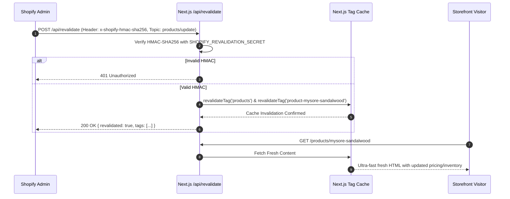
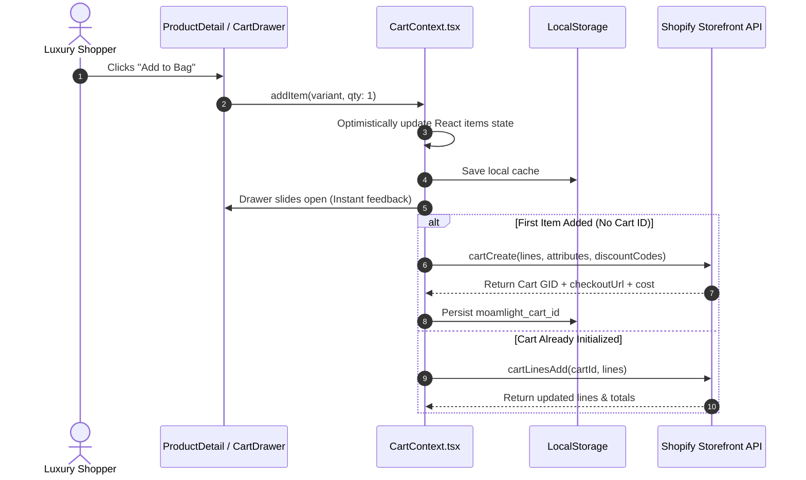

# MOAMLIGHT D2C E-Commerce: Shopify Storefront API Integration Specification
**Brand**: MOAMLIGHT (Handcrafted Indian D2C Luxury Scented Candles)  
**Document Type**: Technical Architecture & Implementation Blueprint  
**Target File**: `plans/shopify_integration_spec.md`  
**API Target**: Shopify Storefront GraphQL API (Version `2024-07`)  
**Frontend Framework**: Next.js 14+ (App Router, Server Components, Route Handlers)  
**Status**: Ready for Implementation  

---

## 1. Executive Summary & Architecture Overview

### 1.1 Architectural Vision
MOAMLIGHT's digital sanctuary requires a decoupled, headless commerce architecture that preserves the bespoke editorial elegance, high-performance page loads, and rich olfactive storytelling created in Next.js 14, while delegating catalog management, multi-variant inventory tracking, secure Indian payment orchestration (UPI, Cards, NetBanking, COD), and logistics fulfillment to Shopify's global e-commerce engine.

The headless architecture establishes a clear separation of concerns:
- **Presentation Layer (Next.js 14 App Router)**: Responsible for server-rendered editorial landing pages, custom interactive scent pyramid explorers, candle ritual accordions, and a fluid, responsive shopping bag drawer powered by Framer Motion and Tailwind CSS.
- **Data & Middleware Layer (`lib/shopify`)**: A type-safe GraphQL client with automatic mock fallback, payload normalizers, on-demand cache tag revalidation, and optimistic cart synchronization.
- **Backend & Commerce Engine (Shopify Storefront & Admin)**: Authoritative source of catalog truth, custom metafield definitions, inventory reservation, discount logic, and certified PCI-DSS compliant checkout.

```mermaid
flowchart TD
    subgraph Client["Next.js Presentation Tier (Client)"]
        Browser["User Browser / Mobile PWA"]
        CartDrawer["CartDrawer.tsx & PDP UI"]
        CartCtx["CartContext (Optimistic State + LocalStorage)"]
    end

    subgraph NextServer["Next.js 14 App Router (Node.js/Edge Runtime)"]
        RSC["React Server Components (Catalog / PDP)"]
        RevalidateAPI["Webhook Route Handler (/api/revalidate)"]
        ShopifyClient["Shopify GraphQL Client (lib/shopify/client.ts)"]
        MockData["Local Fallback Store (data/products.ts)"]
        NextCache["Next.js Data Cache (Tag-based ISR)"]
    end

    subgraph Shopify["Shopify Cloud Infrastructure"]
        StorefrontAPI["Storefront GraphQL API (2024-07)"]
        ShopifyCheckout["Shopify-Hosted Checkout (webUrl / checkoutUrl)"]
        AdminWebhooks["Shopify Event Webhooks (HMAC-SHA256)"]
    end

    Browser -->|Interacts| CartDrawer
    CartDrawer -->|State Dispatches| CartCtx
    CartCtx -->|Background Mutation| ShopifyClient
    RSC -->|Fetch Products| ShopifyClient
    ShopifyClient --> NextCache
    NextCache -->|Cache Miss / Bypass| StorefrontAPI
    ShopifyClient -.->|Missing Credentials Fallback| MockData
    AdminWebhooks -->|products/update, collections/update| RevalidateAPI
    RevalidateAPI -->|revalidateTag('products')| NextCache
    CartDrawer -->|Redirect to Checkout| ShopifyCheckout
```

### 1.2 Core Architectural Tenets
1. **Zero Build-Breakage Guarantee (Graceful Mock Fallback)**: The application must automatically detect missing or invalid Shopify credentials and switch to the curated mock dataset in `data/products.ts`. Neither `next build`, local developers, nor CI/CD pull-request previews will ever fail due to unconfigured remote credentials.
2. **Sub-Millisecond Edge Performance with Stale-While-Revalidate (SWR)**: Product catalog queries are statically pre-rendered and tagged with Next.js fetch tags (`products`, `product-[handle]`). They are served instantaneously from the edge cache and revalidated on-demand via Shopify webhooks.
3. **Optimistic Cart UI with Resilient Background Sync**: Adding to cart, changing quantities, applying coupons (`MOAM10`), and selecting gift wrapping update the local React state instantly for zero perceived latency, while a background queue reconciles with the Shopify `cartCreate` and `cartLinesAdd` APIs.
4. **Indian D2C Luxury Checkout Integration**: Complete support for Cash on Delivery (COD) trust indicators, automatic gift notes/personalization attributes, and direct redirection to Shopify's high-converting checkout engine.

---

## 2. Environment Variables Specification & Fallback Strategy

### 2.1 Configuration Matrix

| Variable Name | Exposure | Required | Default Value | Description |
| :--- | :--- | :--- | :--- | :--- |
| `NEXT_PUBLIC_SHOPIFY_STORE_DOMAIN` | Public (Client/Server) | Optional* | `""` | The myshopify domain (e.g., `moamlight.myshopify.com` or custom headless domain). |
| `NEXT_PUBLIC_SHOPIFY_STOREFRONT_ACCESS_TOKEN` | Public (Client/Server) | Optional* | `""` | Public Storefront API access token generated from the Shopify Headless Sales Channel. |
| `SHOPIFY_STOREFRONT_API_VERSION` | Server Only | Optional | `2024-07` | Target Shopify Storefront GraphQL API release version. |
| `SHOPIFY_REVALIDATION_SECRET` | Server Only | Optional* | `""` | Shared HMAC secret for verifying incoming webhooks from Shopify Admin at `/api/revalidate`. |
| `NEXT_PUBLIC_FORCE_MOCK_DATA` | Public (Client/Server) | Optional | `false` | Explicit toggle to force mock data even when credentials exist (useful for testing & offline dev). |

> [!NOTE]
> `*` Optional strictly in terms of application execution: if omitted, the application operates cleanly in **Mock Mode**, ensuring complete functionality for frontend development and visual regression testing without external API dependencies.

### 2.2 Environment Validation & Zod Schema

To prevent runtime crashes caused by misconfigured environment variables, runtime configuration is validated using a centralized configuration module:

```typescript
// lib/shopify/config.ts
import { z } from 'zod';

const envSchema = z.object({
  storeDomain: z.string().optional().default(''),
  storefrontAccessToken: z.string().optional().default(''),
  apiVersion: z.string().default('2024-07'),
  revalidationSecret: z.string().optional().default(''),
  forceMock: z.boolean().default(false),
});

const rawEnv = {
  storeDomain: process.env.NEXT_PUBLIC_SHOPIFY_STORE_DOMAIN?.replace(/^https?:\/\//, '').replace(/\/$/, '') || '',
  storefrontAccessToken: process.env.NEXT_PUBLIC_SHOPIFY_STOREFRONT_ACCESS_TOKEN || '',
  apiVersion: process.env.SHOPIFY_STOREFRONT_API_VERSION || '2024-07',
  revalidationSecret: process.env.SHOPIFY_REVALIDATION_SECRET || '',
  forceMock: process.env.NEXT_PUBLIC_FORCE_MOCK_DATA === 'true',
};

export const shopifyConfig = envSchema.parse(rawEnv);

export const isShopifyConfigured = (): boolean => {
  return (
    !shopifyConfig.forceMock &&
    Boolean(shopifyConfig.storeDomain) &&
    Boolean(shopifyConfig.storefrontAccessToken) &&
    !shopifyConfig.storeDomain.includes('your-store') &&
    !shopifyConfig.storefrontAccessToken.includes('your-token')
  );
};
```

### 2.3 Fallback & Mock Strategy Execution

When `isShopifyConfigured()` resolves to `false`:
1. **Catalog Requests (`getAllProducts`, `getProductBySlug`)**:
   - Return normalized data directly from `data/products.ts`.
   - Log a single informative console message in development:  
     `[Shopify] Credentials not detected. Operating in Local Mock Catalog mode.`
   - No network requests are made, preventing DNS errors, 401 Unauthorized responses, or build pipeline terminations.
2. **Cart Mutations (`createCart`, `addToCart`, `updateCart`)**:
   - Operate entirely against browser `localStorage` (key: `moamlight_cart_v1`).
   - Mock cart IDs are generated (`mock_cart_${Date.now()}`).
   - Checkout button routes users directly to the built-in Next.js `/checkout` page (`app/checkout/page.tsx`).
3. **When Configured**:
   - Catalog queries fetch from `https://${storeDomain}/api/${apiVersion}/graphql.json`.
   - Cart mutations sync with Shopify's Storefront Cart API.
   - Checkout button redirects directly to Shopify's secure `checkoutUrl`.

---

## 3. Shopify Storefront GraphQL Schemas, Queries & Mutations

All queries and mutations target Storefront API version `2024-07` and strictly adhere to standard GraphQL fragments to guarantee payload reusability.

### 3.1 Custom Metafield Architecture for MOAMLIGHT
To render MOAMLIGHT's sensory-driven product pages without hardcoded frontend strings, the following custom metafields must be registered in Shopify Admin (`Settings > Custom Data > Products` and `Variants`):

| Metafield Key | Namespace | Type | Description | Frontend Mapping |
| :--- | :--- | :--- | :--- | :--- |
| `tagline` | `custom` | `single_line_text_field` | Poetic one-line essence | `product.tagline` |
| `scent_category` | `custom` | `single_line_text_field` | Olfactive family (e.g. 'Woody & Meditative') | `product.category` |
| `mood` | `custom` | `single_line_text_field` | Sensorial vibe and atmosphere | `product.mood` |
| `intensity` | `custom` | `single_line_text_field` | Scent throw: 'Subtle' \| 'Moderate' \| 'Intense' | `product.intensity` |
| `top_notes` | `custom` | `list.single_line_text_field` | Scent pyramid top notes array | `product.scentPyramid.topNotes` |
| `heart_notes` | `custom` | `list.single_line_text_field` | Scent pyramid heart notes array | `product.scentPyramid.heartNotes` |
| `base_notes` | `custom` | `list.single_line_text_field` | Scent pyramid base notes array | `product.scentPyramid.baseNotes` |
| `scent_description` | `custom` | `multi_line_text_field` | Olfactive backstory paragraph | `product.scentPyramid.description` |
| `wax_type` | `custom` | `single_line_text_field` | Botanical wax formulation | `product.specs.waxType` |
| `wick_type` | `custom` | `single_line_text_field` | Braided cotton / wood wick details | `product.specs.wickType` |
| `vessel` | `custom` | `single_line_text_field` | Vessel material (fluted amber/ceramic) | `product.specs.vessel` |
| `dimensions` | `custom` | `single_line_text_field` | Physical dimensions | `product.specs.dimensions` |
| `burn_time` | `custom` | `single_line_text_field` | Total burn time description | `product.specs.burnTime` |
| `origin` | `custom` | `single_line_text_field` | Artisan pouring location | `product.specs.origin` |
| `ritual_first_burn` | `custom` | `multi_line_text_field` | Memory melt pool instructions | `product.ritualGuide.firstBurn` |
| `ritual_maintenance`| `custom` | `multi_line_text_field` | Wick trimming & soot prevention | `product.ritualGuide.maintenance` |
| `ritual_safety` | `custom` | `multi_line_text_field` | Fire safety and extinguishing | `product.ritualGuide.safety` |
| `ritual_vessel_reuse`| `custom` | `multi_line_text_field` | Upcycling instructions | `product.ritualGuide.vesselReuse` |
| `weight_grams` | `custom` (Variant) | `number_integer` | Net wax weight in grams | `variant.weightGrams` |
| `burn_time_hours` | `custom` (Variant) | `number_integer` | Variant burn time in hours | `variant.burnTimeHours` |
| `wicks_count` | `custom` (Variant) | `number_integer` | Number of cotton wicks | `variant.wicksCount` |

---

### 3.2 GraphQL Queries

#### 3.2.1 Core Product Fragment
```graphql
fragment ProductFragment on Product {
  id
  handle
  title
  description
  descriptionHtml
  availableForSale
  tags
  vendor
  productType
  priceRange {
    minVariantPrice {
      amount
      currencyCode
    }
    maxVariantPrice {
      amount
      currencyCode
    }
  }
  compareAtPriceRange {
    minVariantPrice {
      amount
      currencyCode
    }
  }
  images(first: 10) {
    edges {
      node {
        url(transform: { maxWidth: 1200, preferredContentType: WEBP })
        altText
        width
        height
      }
    }
  }
  variants(first: 20) {
    edges {
      node {
        id
        title
        sku
        availableForSale
        quantityAvailable
        price {
          amount
          currencyCode
        }
        compareAtPrice {
          amount
          currencyCode
        }
        selectedOptions {
          name
          value
        }
        weight
        weightUnit
        weightGrams: metafield(namespace: "custom", key: "weight_grams") {
          value
        }
        burnTimeHours: metafield(namespace: "custom", key: "burn_time_hours") {
          value
        }
        wicksCount: metafield(namespace: "custom", key: "wicks_count") {
          value
        }
      }
    }
  }
  tagline: metafield(namespace: "custom", key: "tagline") {
    value
  }
  scentCategory: metafield(namespace: "custom", key: "scent_category") {
    value
  }
  mood: metafield(namespace: "custom", key: "mood") {
    value
  }
  intensity: metafield(namespace: "custom", key: "intensity") {
    value
  }
  topNotes: metafield(namespace: "custom", key: "top_notes") {
    value
  }
  heartNotes: metafield(namespace: "custom", key: "heart_notes") {
    value
  }
  baseNotes: metafield(namespace: "custom", key: "base_notes") {
    value
  }
  scentDescription: metafield(namespace: "custom", key: "scent_description") {
    value
  }
  waxType: metafield(namespace: "custom", key: "wax_type") {
    value
  }
  wickType: metafield(namespace: "custom", key: "wick_type") {
    value
  }
  vessel: metafield(namespace: "custom", key: "vessel") {
    value
  }
  dimensions: metafield(namespace: "custom", key: "dimensions") {
    value
  }
  burnTime: metafield(namespace: "custom", key: "burn_time") {
    value
  }
  origin: metafield(namespace: "custom", key: "origin") {
    value
  }
  ritualFirstBurn: metafield(namespace: "custom", key: "ritual_first_burn") {
    value
  }
  ritualMaintenance: metafield(namespace: "custom", key: "ritual_maintenance") {
    value
  }
  ritualSafety: metafield(namespace: "custom", key: "ritual_safety") {
    value
  }
  ritualVesselReuse: metafield(namespace: "custom", key: "ritual_vessel_reuse") {
    value
  }
}
```

#### 3.2.2 Query: `getProducts`
Used for catalogue index, bestseller grids, and scent explorer carousels.
```graphql
query getProducts($first: Int = 50, $sortKey: ProductSortKeys = BEST_SELLING, $reverse: Boolean = false, $query: String) {
  products(first: $first, sortKey: $sortKey, reverse: $reverse, query: $query) {
    edges {
      cursor
      node {
        ...ProductFragment
      }
    }
    pageInfo {
      hasNextPage
      hasPreviousPage
      startCursor
      endCursor
    }
  }
}
```

#### 3.2.3 Query: `getProduct` (by Handle)
Used by `app/products/[id]/page.tsx` for full product details, related products, and custom recommendations.
```graphql
query getProductByHandle($handle: String!) {
  product(handle: $handle) {
    ...ProductFragment
  }
}
```

---

### 3.3 GraphQL Cart Mutations & Queries

#### 3.3.1 Cart Fragment
```graphql
fragment CartFragment on Cart {
  id
  checkoutUrl
  totalQuantity
  note
  appliedGiftCards {
    lastCharacters
    balance {
      amount
      currencyCode
    }
  }
  discountCodes {
    code
    applicable
  }
  attributes {
    key
    value
  }
  cost {
    subtotalAmount {
      amount
      currencyCode
    }
    totalAmount {
      amount
      currencyCode
    }
    totalDutyAmount {
      amount
      currencyCode
    }
    totalTaxAmount {
      amount
      currencyCode
    }
  }
  lines(first: 100) {
    edges {
      node {
        id
        quantity
        cost {
          totalAmount {
            amount
            currencyCode
          }
        }
        merchandise {
          ... on ProductVariant {
            id
            title
            sku
            price {
              amount
              currencyCode
            }
            compareAtPrice {
              amount
              currencyCode
            }
            product {
              id
              handle
              title
              scentCategory: metafield(namespace: "custom", key: "scent_category") {
                value
              }
            }
            image {
              url(transform: { maxWidth: 300, preferredContentType: WEBP })
              altText
            }
            weightGrams: metafield(namespace: "custom", key: "weight_grams") {
              value
            }
          }
        }
      }
    }
  }
}
```

#### 3.3.2 Mutation: `createCart` (`cartCreate`)
Initializes a new cart on Shopify with line items, optional discount codes, customer attributes, and notes.
```graphql
mutation cartCreate($input: CartInput) {
  cartCreate(input: $input) {
    cart {
      ...CartFragment
    }
    userErrors {
      field
      message
      code
    }
  }
}
```
*Variables Example:*
```json
{
  "input": {
    "lines": [
      {
        "merchandiseId": "gid://shopify/ProductVariant/44123456789012",
        "quantity": 1
      }
    ],
    "attributes": [
      { "key": "isGift", "value": "true" },
      { "key": "giftMessage", "value": "Wishing you warmth and peace in your new sanctuary." }
    ],
    "discountCodes": ["MOAM10"]
  }
}
```

#### 3.3.3 Mutation: `addToCart` (`cartLinesAdd`)
Appends merchandise items to an existing active cart session.
```graphql
mutation cartLinesAdd($cartId: ID!, $lines: [CartLineInput!]!) {
  cartLinesAdd(cartId: $cartId, lines: $lines) {
    cart {
      ...CartFragment
    }
    userErrors {
      field
      message
      code
    }
  }
}
```

#### 3.3.4 Mutation: `updateCart` (`cartLinesUpdate` & `cartLinesRemove`)
Updates quantities or removes items from the cart.
```graphql
mutation cartLinesUpdate($cartId: ID!, $lines: [CartLineUpdateInput!]!) {
  cartLinesUpdate(cartId: $cartId, lines: $lines) {
    cart {
      ...CartFragment
    }
    userErrors {
      field
      message
      code
    }
  }
}

mutation cartLinesRemove($cartId: ID!, $lineIds: [ID!]!) {
  cartLinesRemove(cartId: $cartId, lineIds: $lineIds) {
    cart {
      ...CartFragment
    }
    userErrors {
      field
      message
      code
    }
  }
}
```

#### 3.3.5 Mutation: `cartDiscountCodesUpdate` & `cartAttributesUpdate`
Manages promotional coupons and gifting options:
```graphql
mutation cartDiscountCodesUpdate($cartId: ID!, $discountCodes: [String!]) {
  cartDiscountCodesUpdate(cartId: $cartId, discountCodes: $discountCodes) {
    cart {
      ...CartFragment
    }
    userErrors {
      field
      message
      code
    }
  }
}

mutation cartAttributesUpdate($cartId: ID!, $attributes: [AttributeInput!]!) {
  cartAttributesUpdate(cartId: $cartId, attributes: $attributes) {
    cart {
      ...CartFragment
    }
    userErrors {
      field
      message
      code
    }
  }
}
```

#### 3.3.6 Query: `getCart`
Rehydrates the user's active shopping bag upon page refresh or return visits.
```graphql
query getCart($cartId: ID!) {
  cart(id: $cartId) {
    ...CartFragment
  }
}
```

---

## 4. Data Transformation & Normalization Pipeline

To guarantee that existing UI components (`ProductCard.tsx`, `CartDrawer.tsx`, `CartItemRow.tsx`, `ScentPyramidCard.tsx`) continue operating without modifications, the Shopify GraphQL response is translated into MOAMLIGHT's domain models (`Product`, `ProductVariant`, `CartItem`).

### 4.1 Product Normalizer Implementation

```typescript
// lib/shopify/normalizers.ts
import { Product, ProductVariant, ScentCategory, CandleSpecs, ScentPyramid } from '@/types/product';
import { ShopifyProduct, ShopifyVariant } from './types';

export function parseMetafieldJson<T>(value?: string | null, fallback: T = [] as unknown as T): T {
  if (!value) return fallback;
  try {
    return JSON.parse(value) as T;
  } catch {
    return fallback;
  }
}

export function normalizeProductVariant(variantNode: ShopifyVariant): ProductVariant {
  const price = Math.round(parseFloat(variantNode.price.amount));
  const mrp = variantNode.compareAtPrice
    ? Math.round(parseFloat(variantNode.compareAtPrice.amount))
    : Math.round(price * 1.25); // Fallback MRP

  return {
    id: variantNode.id,
    name: variantNode.title,
    weightGrams: variantNode.weightGrams?.value ? parseInt(variantNode.weightGrams.value, 10) : 240,
    burnTimeHours: variantNode.burnTimeHours?.value ? parseInt(variantNode.burnTimeHours.value, 10) : 50,
    wicksCount: variantNode.wicksCount?.value ? parseInt(variantNode.wicksCount.value, 10) : 1,
    price,
    mrp,
    inStock: variantNode.availableForSale && (variantNode.quantityAvailable === null || variantNode.quantityAvailable > 0),
    sku: variantNode.sku || '',
  };
}

export function normalizeProduct(node: ShopifyProduct): Product {
  const defaultPrice = Math.round(parseFloat(node.priceRange.minVariantPrice.amount));
  const defaultMrp = node.compareAtPriceRange?.minVariantPrice?.amount
    ? Math.round(parseFloat(node.compareAtPriceRange.minVariantPrice.amount))
    : Math.round(defaultPrice * 1.25);

  const images = node.images.edges.map((edge) => edge.node.url);
  const variants = node.variants.edges.map((edge) => normalizeProductVariant(edge.node));

  // Parse notes from metafield (can be JSON array or comma separated)
  const parseNotes = (val?: string | null): string[] => {
    if (!val) return [];
    try {
      const parsed = JSON.parse(val);
      if (Array.isArray(parsed)) return parsed;
    } catch {
      return val.split(',').map((s) => s.trim()).filter(Boolean);
    }
    return [];
  };

  const scentCategory: ScentCategory = (node.scentCategory?.value as ScentCategory) || 'Woody & Meditative';

  const scentPyramid: ScentPyramid = {
    topNotes: parseNotes(node.topNotes?.value),
    heartNotes: parseNotes(node.heartNotes?.value),
    baseNotes: parseNotes(node.baseNotes?.value),
    description: node.scentDescription?.value || node.description || '',
  };

  const specs: CandleSpecs = {
    waxType: node.waxType?.value || '100% Golden Botanical Soy Wax',
    wickType: node.wickType?.value || 'Dual Lead-Free Braided Egyptian Cotton',
    vessel: node.vessel?.value || 'Handcrafted Fluted Amber Glass',
    dimensions: node.dimensions?.value || '8.5 cm Dia x 10 cm H',
    burnTime: node.burnTime?.value || '55+ Hours',
    origin: node.origin?.value || 'Artisan hand-poured in micro-batches, Bengaluru, India',
  };

  return {
    id: node.id,
    slug: node.handle,
    title: node.title,
    tagline: node.tagline?.value || node.title,
    category: scentCategory,
    mood: node.mood?.value || 'Meditative, grounding, quiet luxury',
    intensity: (node.intensity?.value as 'Subtle' | 'Moderate' | 'Intense') || 'Moderate',
    defaultPrice,
    defaultMrp,
    images: images.length > 0 ? images : ['/images/placeholder-candle.jpg'],
    rating: 4.9, // Can be mapped to Judge.me/Yotpo metafield
    reviewsCount: 120,
    bestseller: node.tags.map((t) => t.toLowerCase()).includes('bestseller'),
    featured: node.tags.map((t) => t.toLowerCase()).includes('featured'),
    scentPyramid,
    variants,
    specs,
    story: node.descriptionHtml || node.description || '',
    ritualGuide: {
      firstBurn: node.ritualFirstBurn?.value || 'Burn uninterrupted for 3-4 hours on your first session to prevent tunneling.',
      maintenance: node.ritualMaintenance?.value || 'Trim wicks to 5mm before each lighting for a whisper-clean flame.',
      safety: node.ritualSafety?.value || 'Burn on heat-resistant flat surfaces away from drafts. Never leave unattended.',
      vesselReuse: node.ritualVesselReuse?.value || 'Pour warm water when 1/2 inch wax remains. Clean vessel and repurpose.',
    },
    reviews: [],
    pairsWithSlugs: [],
  };
}
```

---

## 5. Caching & On-Demand Revalidation Strategy

### 5.1 Next.js Fetch Cache Architecture
MOAMLIGHT leverages Next.js 14 tag-based caching to achieve instant page loads without serving outdated inventory or pricing.

```typescript
// lib/shopify/client.ts
const SHOPIFY_GRAPHQL_ENDPOINT = `https://${shopifyConfig.storeDomain}/api/${shopifyConfig.apiVersion}/graphql.json`;

export async function shopifyFetch<T>({
  query,
  variables,
  tags = ['shopify'],
  revalidate = 3600, // Background revalidation fallback (1 hour)
}: {
  query: string;
  variables?: Record<string, any>;
  tags?: string[];
  revalidate?: number | false;
}): Promise<T> {
  const response = await fetch(SHOPIFY_GRAPHQL_ENDPOINT, {
    method: 'POST',
    headers: {
      'Content-Type': 'application/json',
      'X-Shopify-Storefront-Access-Token': shopifyConfig.storefrontAccessToken,
    },
    body: JSON.stringify({ query, variables }),
    next: {
      tags,
      revalidate,
    },
  });

  if (!response.ok) {
    throw new Error(`[Shopify Storefront API] HTTP error ${response.status}: ${response.statusText}`);
  }

  const json = await response.json();
  if (json.errors) {
    throw new Error(`[Shopify GraphQL Error] ${JSON.stringify(json.errors)}`);
  }

  return json.data;
}
```

Cache tags applied throughout the catalog:
- Catalog Queries (`getProducts`): `tags: ['products']`
- Single Product (`getProductByHandle`): `tags: ['products', `product-${handle}`]`
- Collection Queries: `tags: ['collections', `collection-${handle}`]`

---

### 5.2 Webhook Revalidation Route Handler (`app/api/revalidate/route.ts`)

Shopify emits webhooks whenever a merchant creates, modifies, or deletes products or inventory levels. The Next.js Route Handler validates the Shopify HMAC signature and purges specific tags from the cache.

```typescript
// app/api/revalidate/route.ts
import { NextRequest, NextResponse } from 'next/server';
import { revalidateTag } from 'next/cache';
import crypto from 'crypto';

function verifyShopifyHmac(body: string, hmacHeader: string | null, secret: string): boolean {
  if (!hmacHeader || !secret) return false;
  const hash = crypto
    .createHmac('sha256', secret)
    .update(body, 'utf8')
    .digest('base64');
  return crypto.timingSafeEqual(Buffer.from(hash), Buffer.from(hmacHeader));
}

export async function POST(req: NextRequest) {
  const secret = process.env.SHOPIFY_REVALIDATION_SECRET;
  const hmac = req.headers.get('x-shopify-hmac-sha256');
  const topic = req.headers.get('x-shopify-topic'); // e.g., 'products/update'
  const rawBody = await req.text();

  if (!secret) {
    console.warn('[Webhook] SHOPIFY_REVALIDATION_SECRET not configured.');
    return NextResponse.json({ error: 'Revalidation secret missing' }, { status: 500 });
  }

  // Security check: Verify cryptographic signature
  const isValid = verifyShopifyHmac(rawBody, hmac, secret);
  if (!isValid) {
    console.error('[Webhook] Unauthorized HMAC signature mismatch.');
    return NextResponse.json({ error: 'Unauthorized signature' }, { status: 401 });
  }

  try {
    const payload = JSON.parse(rawBody);
    const revalidatedTags: string[] = [];

    switch (topic) {
      case 'products/create':
      case 'products/delete':
        revalidateTag('products');
        revalidatedTags.push('products');
        break;

      case 'products/update':
        revalidateTag('products');
        revalidatedTags.push('products');
        if (payload.handle) {
          const productTag = `product-${payload.handle}`;
          revalidateTag(productTag);
          revalidatedTags.push(productTag);
        }
        break;

      case 'collections/update':
      case 'collections/delete':
        revalidateTag('collections');
        revalidatedTags.push('collections');
        break;

      case 'inventory_levels/update':
        // Inventory changes require catalog tag invalidation
        revalidateTag('products');
        revalidatedTags.push('products');
        break;

      default:
        revalidateTag('products');
        revalidatedTags.push('products');
        break;
    }

    return NextResponse.json({
      revalidated: true,
      topic,
      tags: revalidatedTags,
      timestamp: new Date().toISOString(),
    });
  } catch (error: any) {
    console.error('[Webhook] Failed to process revalidation event:', error);
    return NextResponse.json({ error: error.message || 'Internal server error' }, { status: 500 });
  }
}
```



---

## 6. Cart Engine & State Synchronization Plan

### 6.1 State Flow & Storage Model
The existing `CartContext.tsx` holds a rich client state with Indian commerce requirements (free shipping progress at ₹999, GST computation, coupon codes like `MOAM10`, gift packaging toggles). 

To ensure complete backward compatibility while adding real Shopify checkout capabilities, `CartContext` adopts an **Optimistic Client with Background Shopify Reconciliation** pattern:

1. **State Persistence**:
   - `moamlight_cart_id`: Stores the Shopify GraphQL Cart GID (`gid://shopify/Cart/...`).
   - `moamlight_cart_v1`: Stores cached items, gifting notes, and coupon code for instant SSR rehydration.
2. **Optimistic Updates**:
   - `addItem`, `updateQuantity`, and `removeItem` execute synchronously on React state, firing immediate Framer Motion animations and opening the drawer.
   - A debounced async runner communicates with Shopify's Cart API.
   - If Shopify returns out-of-stock user errors, the local state reverts and triggers a user-facing toast alert.
3. **Cart Rehydration Lifecycle**:
   - On initial mount, `useEffect` reads `moamlight_cart_id`.
   - If present and credentials are valid, it fires `getCart(cartId)`.
   - If the Shopify cart has expired (typically 10–14 days of merchant inactivity), the client transparently clears the expired ID and generates a new cart on the next user action.



---

## 7. Checkout Flow & Gifting Orchestration

### 7.1 Direct Redirect Architecture
Shopify provides a hosted, optimized checkout URL (`cart.checkoutUrl`) for each cart instance. When the user clicks **"Proceed to Checkout"** in `CartDrawer.tsx` or `/checkout`:

1. **Active Coupon Transfer**:
   - The Shopify Cart mutation `cartDiscountCodesUpdate` ensures discounts (e.g. `MOAM10`) are attached to the cart in Shopify before redirection.
   - As an extra layer of assurance, the discount parameter is appended to the checkout URL:  
     `${checkoutUrl}&discount=${appliedCoupon.code}`.
2. **Gifting Notes & Custom Attributes**:
   - If the user enables "Send as a Gift" in `GiftOptionToggle.tsx`, the attributes are pushed to Shopify via `cartAttributesUpdate`:
     ```json
     [
       { "key": "Is Gift Order", "value": "Yes" },
       { "key": "Gift Message", "value": "Happy Housewarming, Radhika!" },
       { "key": "Packaging", "value": "Rigid Heritage Box with Teakwood Accent" }
     ]
     ```
   - These attributes appear directly on Shopify Packing Slips, fulfillment emails, and ERP integrations.
3. **COD & Indian Payment Gateway Compatibility**:
   - In India, Cash on Delivery (COD), UPI (Google Pay, PhonePe, Paytm), and EMI are handled seamlessly inside Shopify's checkout when configured with Razorpay / Cashfree / Gokwik / Shiprocket checkout apps.
   - The drawer UI continues to reassure buyers with trust badges: *"Cash on Delivery Available"* and *"100% Safe Transit Guarantee"*.

---

## 8. Detailed Module Blueprint: `lib/shopify/`

The integration code resides within `lib/shopify/` to match Next.js 14 conventions:

```
MOAMLIGHT/
├── lib/
│   ├── formatters.ts
│   ├── utils.ts
│   └── shopify/
│       ├── config.ts              # Zod validation & credentials checker
│       ├── types.ts               # Raw GraphQL response interfaces
│       ├── client.ts              # Fetch wrapper with headers & error handling
│       ├── normalizers.ts         # Shopify GraphQL -> MOAMLIGHT Product & Cart types
│       ├── queries/
│       │   ├── product.ts         # getProductsQuery, getProductByHandleQuery
│       │   └── cart.ts            # cartCreate, cartLinesAdd, cartLinesUpdate, getCart
│       └── index.ts               # Public facade exported to the application
├── app/
│   └── api/
│       └── revalidate/
│           └── route.ts           # Webhook handler for instant cache purging
```

### 8.1 Module Implementation Code

#### 8.1.1 `lib/shopify/types.ts`
```typescript
export interface ShopifyImage {
  url: string;
  altText?: string | null;
  width?: number;
  height?: number;
}

export interface ShopifyMetafield {
  value?: string | null;
}

export interface ShopifyMoney {
  amount: string;
  currencyCode: string;
}

export interface ShopifyVariant {
  id: string;
  title: string;
  sku?: string | null;
  availableForSale: boolean;
  quantityAvailable?: number | null;
  price: ShopifyMoney;
  compareAtPrice?: ShopifyMoney | null;
  selectedOptions: { name: string; value: string }[];
  weight?: number | null;
  weightUnit?: string | null;
  weightGrams?: ShopifyMetafield | null;
  burnTimeHours?: ShopifyMetafield | null;
  wicksCount?: ShopifyMetafield | null;
}

export interface ShopifyProduct {
  id: string;
  handle: string;
  title: string;
  description: string;
  descriptionHtml?: string;
  availableForSale: boolean;
  tags: string[];
  vendor: string;
  productType: string;
  priceRange: {
    minVariantPrice: ShopifyMoney;
    maxVariantPrice: ShopifyMoney;
  };
  compareAtPriceRange?: {
    minVariantPrice: ShopifyMoney;
  } | null;
  images: {
    edges: { node: ShopifyImage }[];
  };
  variants: {
    edges: { node: ShopifyVariant }[];
  };
  tagline?: ShopifyMetafield | null;
  scentCategory?: ShopifyMetafield | null;
  mood?: ShopifyMetafield | null;
  intensity?: ShopifyMetafield | null;
  topNotes?: ShopifyMetafield | null;
  heartNotes?: ShopifyMetafield | null;
  baseNotes?: ShopifyMetafield | null;
  scentDescription?: ShopifyMetafield | null;
  waxType?: ShopifyMetafield | null;
  wickType?: ShopifyMetafield | null;
  vessel?: ShopifyMetafield | null;
  dimensions?: ShopifyMetafield | null;
  burnTime?: ShopifyMetafield | null;
  origin?: ShopifyMetafield | null;
  ritualFirstBurn?: ShopifyMetafield | null;
  ritualMaintenance?: ShopifyMetafield | null;
  ritualSafety?: ShopifyMetafield | null;
  ritualVesselReuse?: ShopifyMetafield | null;
}

export interface ShopifyCartLine {
  id: string;
  quantity: number;
  cost: {
    totalAmount: ShopifyMoney;
  };
  merchandise: {
    id: string;
    title: string;
    sku?: string | null;
    price: ShopifyMoney;
    compareAtPrice?: ShopifyMoney | null;
    product: {
      id: string;
      handle: string;
      title: string;
      scentCategory?: ShopifyMetafield | null;
    };
    image?: ShopifyImage | null;
    weightGrams?: ShopifyMetafield | null;
  };
}

export interface ShopifyCart {
  id: string;
  checkoutUrl: string;
  totalQuantity: number;
  note?: string | null;
  discountCodes?: { code: string; applicable: boolean }[];
  attributes?: { key: string; value: string }[];
  cost: {
    subtotalAmount: ShopifyMoney;
    totalAmount: ShopifyMoney;
    totalTaxAmount?: ShopifyMoney | null;
    totalDutyAmount?: ShopifyMoney | null;
  };
  lines: {
    edges: { node: ShopifyCartLine }[];
  };
}
```

#### 8.1.2 `lib/shopify/queries/product.ts`
```typescript
export const PRODUCT_FRAGMENT = `
  fragment ProductFragment on Product {
    id
    handle
    title
    description
    descriptionHtml
    availableForSale
    tags
    priceRange {
      minVariantPrice {
        amount
        currencyCode
      }
      maxVariantPrice {
        amount
        currencyCode
      }
    }
    compareAtPriceRange {
      minVariantPrice {
        amount
        currencyCode
      }
    }
    images(first: 10) {
      edges {
        node {
          url(transform: { maxWidth: 1200, preferredContentType: WEBP })
          altText
          width
          height
        }
      }
    }
    variants(first: 20) {
      edges {
        node {
          id
          title
          sku
          availableForSale
          quantityAvailable
          price {
            amount
            currencyCode
          }
          compareAtPrice {
            amount
            currencyCode
          }
          weightGrams: metafield(namespace: "custom", key: "weight_grams") {
            value
          }
          burnTimeHours: metafield(namespace: "custom", key: "burn_time_hours") {
            value
          }
          wicksCount: metafield(namespace: "custom", key: "wicks_count") {
            value
          }
        }
      }
    }
    tagline: metafield(namespace: "custom", key: "tagline") { value }
    scentCategory: metafield(namespace: "custom", key: "scent_category") { value }
    mood: metafield(namespace: "custom", key: "mood") { value }
    intensity: metafield(namespace: "custom", key: "intensity") { value }
    topNotes: metafield(namespace: "custom", key: "top_notes") { value }
    heartNotes: metafield(namespace: "custom", key: "heart_notes") { value }
    baseNotes: metafield(namespace: "custom", key: "base_notes") { value }
    scentDescription: metafield(namespace: "custom", key: "scent_description") { value }
    waxType: metafield(namespace: "custom", key: "wax_type") { value }
    wickType: metafield(namespace: "custom", key: "wick_type") { value }
    vessel: metafield(namespace: "custom", key: "vessel") { value }
    dimensions: metafield(namespace: "custom", key: "dimensions") { value }
    burnTime: metafield(namespace: "custom", key: "burn_time") { value }
    origin: metafield(namespace: "custom", key: "origin") { value }
    ritualFirstBurn: metafield(namespace: "custom", key: "ritual_first_burn") { value }
    ritualMaintenance: metafield(namespace: "custom", key: "ritual_maintenance") { value }
    ritualSafety: metafield(namespace: "custom", key: "ritual_safety") { value }
    ritualVesselReuse: metafield(namespace: "custom", key: "ritual_vessel_reuse") { value }
  }
`;

export const GET_PRODUCTS_QUERY = `
  ${PRODUCT_FRAGMENT}
  query getProducts($first: Int = 50, $query: String) {
    products(first: $first, query: $query) {
      edges {
        node {
          ...ProductFragment
        }
      }
    }
  }
`;

export const GET_PRODUCT_BY_HANDLE_QUERY = `
  ${PRODUCT_FRAGMENT}
  query getProductByHandle($handle: String!) {
    product(handle: $handle) {
      ...ProductFragment
    }
  }
`;
```

#### 8.1.3 `lib/shopify/queries/cart.ts`
```typescript
export const CART_FRAGMENT = `
  fragment CartFragment on Cart {
    id
    checkoutUrl
    totalQuantity
    note
    discountCodes {
      code
      applicable
    }
    attributes {
      key
      value
    }
    cost {
      subtotalAmount {
        amount
        currencyCode
      }
      totalAmount {
        amount
        currencyCode
      }
      totalTaxAmount {
        amount
        currencyCode
      }
    }
    lines(first: 100) {
      edges {
        node {
          id
          quantity
          cost {
            totalAmount {
              amount
              currencyCode
            }
          }
          merchandise {
            ... on ProductVariant {
              id
              title
              sku
              price {
                amount
                currencyCode
              }
              compareAtPrice {
                amount
                currencyCode
              }
              product {
                id
                handle
                title
                scentCategory: metafield(namespace: "custom", key: "scent_category") {
                  value
                }
              }
              image {
                url(transform: { maxWidth: 300, preferredContentType: WEBP })
                altText
              }
              weightGrams: metafield(namespace: "custom", key: "weight_grams") {
                value
              }
            }
          }
        }
      }
    }
  }
`;

export const CART_CREATE_MUTATION = `
  ${CART_FRAGMENT}
  mutation cartCreate($input: CartInput) {
    cartCreate(input: $input) {
      cart {
        ...CartFragment
      }
      userErrors {
        field
        message
      }
    }
  }
`;

export const CART_LINES_ADD_MUTATION = `
  ${CART_FRAGMENT}
  mutation cartLinesAdd($cartId: ID!, $lines: [CartLineInput!]!) {
    cartLinesAdd(cartId: $cartId, lines: $lines) {
      cart {
        ...CartFragment
      }
      userErrors {
        field
        message
      }
    }
  }
`;

export const CART_LINES_UPDATE_MUTATION = `
  ${CART_FRAGMENT}
  mutation cartLinesUpdate($cartId: ID!, $lines: [CartLineUpdateInput!]!) {
    cartLinesUpdate(cartId: $cartId, lines: $lines) {
      cart {
        ...CartFragment
      }
      userErrors {
        field
        message
      }
    }
  }
`;

export const CART_LINES_REMOVE_MUTATION = `
  ${CART_FRAGMENT}
  mutation cartLinesRemove($cartId: ID!, $lineIds: [ID!]!) {
    cartLinesRemove(cartId: $cartId, lineIds: $lineIds) {
      cart {
        ...CartFragment
      }
      userErrors {
        field
        message
      }
    }
  }
`;

export const CART_DISCOUNT_CODES_UPDATE_MUTATION = `
  ${CART_FRAGMENT}
  mutation cartDiscountCodesUpdate($cartId: ID!, $discountCodes: [String!]) {
    cartDiscountCodesUpdate(cartId: $cartId, discountCodes: $discountCodes) {
      cart {
        ...CartFragment
      }
      userErrors {
        field
        message
      }
    }
  }
`;

export const CART_ATTRIBUTES_UPDATE_MUTATION = `
  ${CART_FRAGMENT}
  mutation cartAttributesUpdate($cartId: ID!, $attributes: [AttributeInput!]!) {
    cartAttributesUpdate(cartId: $cartId, attributes: $attributes) {
      cart {
        ...CartFragment
      }
      userErrors {
        field
        message
      }
    }
  }
`;

export const GET_CART_QUERY = `
  ${CART_FRAGMENT}
  query getCart($cartId: ID!) {
    cart(id: $cartId) {
      ...CartFragment
    }
  }
`;
```

#### 8.1.4 Public Facade (`lib/shopify/index.ts`)
```typescript
import { isShopifyConfigured } from './config';
import { shopifyFetch } from './client';
import { GET_PRODUCTS_QUERY, GET_PRODUCT_BY_HANDLE_QUERY } from './queries/product';
import {
  CART_CREATE_MUTATION,
  CART_LINES_ADD_MUTATION,
  CART_LINES_UPDATE_MUTATION,
  CART_LINES_REMOVE_MUTATION,
  CART_DISCOUNT_CODES_UPDATE_MUTATION,
  CART_ATTRIBUTES_UPDATE_MUTATION,
  GET_CART_QUERY,
} from './queries/cart';
import { normalizeProduct } from './normalizers';
import { PRODUCTS, getProductBySlug } from '@/data/products';
import { Product } from '@/types/product';
import { ShopifyProduct, ShopifyCart } from './types';

// ==========================================
// Catalog APIs
// ==========================================

export async function getProducts(): Promise<Product[]> {
  if (!isShopifyConfigured()) {
    return PRODUCTS;
  }

  try {
    const data = await shopifyFetch<{ products: { edges: { node: ShopifyProduct }[] } }>({
      query: GET_PRODUCTS_QUERY,
      tags: ['products'],
      revalidate: 3600,
    });
    return data.products.edges.map((edge) => normalizeProduct(edge.node));
  } catch (error) {
    console.warn('[Shopify API] getProducts failed, falling back to mock dataset:', error);
    return PRODUCTS;
  }
}

export async function getProduct(handle: string): Promise<Product | null> {
  if (!isShopifyConfigured()) {
    return getProductBySlug(handle) || null;
  }

  try {
    const data = await shopifyFetch<{ product: ShopifyProduct | null }>({
      query: GET_PRODUCT_BY_HANDLE_QUERY,
      variables: { handle },
      tags: ['products', `product-${handle}`],
      revalidate: 3600,
    });

    if (!data.product) {
      return getProductBySlug(handle) || null;
    }

    return normalizeProduct(data.product);
  } catch (error) {
    console.warn(`[Shopify API] getProduct(${handle}) failed, fallback to mock:`, error);
    return getProductBySlug(handle) || null;
  }
}

// ==========================================
// Cart APIs (Client-Invoked Route or Action)
// ==========================================

export async function createShopifyCart(lines?: { merchandiseId: string; quantity: number }[]): Promise<ShopifyCart | null> {
  if (!isShopifyConfigured()) return null;

  const data = await shopifyFetch<{ cartCreate: { cart: ShopifyCart } }>({
    query: CART_CREATE_MUTATION,
    variables: { input: { lines } },
    revalidate: false,
  });

  return data.cartCreate.cart;
}

export async function addLinesToCart(cartId: string, lines: { merchandiseId: string; quantity: number }[]): Promise<ShopifyCart | null> {
  if (!isShopifyConfigured()) return null;

  const data = await shopifyFetch<{ cartLinesAdd: { cart: ShopifyCart } }>({
    query: CART_LINES_ADD_MUTATION,
    variables: { cartId, lines },
    revalidate: false,
  });

  return data.cartLinesAdd.cart;
}

export async function updateCartLines(cartId: string, lines: { id: string; quantity: number }[]): Promise<ShopifyCart | null> {
  if (!isShopifyConfigured()) return null;

  const data = await shopifyFetch<{ cartLinesUpdate: { cart: ShopifyCart } }>({
    query: CART_LINES_UPDATE_MUTATION,
    variables: { cartId, lines },
    revalidate: false,
  });

  return data.cartLinesUpdate.cart;
}

export async function removeCartLines(cartId: string, lineIds: string[]): Promise<ShopifyCart | null> {
  if (!isShopifyConfigured()) return null;

  const data = await shopifyFetch<{ cartLinesRemove: { cart: ShopifyCart } }>({
    query: CART_LINES_REMOVE_MUTATION,
    variables: { cartId, lineIds },
    revalidate: false,
  });

  return data.cartLinesRemove.cart;
}

export async function applyCartDiscount(cartId: string, discountCodes: string[]): Promise<ShopifyCart | null> {
  if (!isShopifyConfigured()) return null;

  const data = await shopifyFetch<{ cartDiscountCodesUpdate: { cart: ShopifyCart } }>({
    query: CART_DISCOUNT_CODES_UPDATE_MUTATION,
    variables: { cartId, discountCodes },
    revalidate: false,
  });

  return data.cartDiscountCodesUpdate.cart;
}

export async function updateCartGiftAttributes(cartId: string, isGift: boolean, giftMessage: string): Promise<ShopifyCart | null> {
  if (!isShopifyConfigured()) return null;

  const attributes = [
    { key: 'is_gift', value: isGift ? 'true' : 'false' },
    { key: 'gift_message', value: giftMessage || '' },
  ];

  const data = await shopifyFetch<{ cartAttributesUpdate: { cart: ShopifyCart } }>({
    query: CART_ATTRIBUTES_UPDATE_MUTATION,
    variables: { cartId, attributes },
    revalidate: false,
  });

  return data.cartAttributesUpdate.cart;
}

export async function getShopifyCart(cartId: string): Promise<ShopifyCart | null> {
  if (!isShopifyConfigured()) return null;

  try {
    const data = await shopifyFetch<{ cart: ShopifyCart | null }>({
      query: GET_CART_QUERY,
      variables: { cartId },
      revalidate: false,
    });
    return data.cart;
  } catch {
    return null;
  }
}
```

---

## 9. Integration Plan with `CartContext.tsx` & UI Components

### 9.1 `CartContext.tsx` Progressive Enhancement
To ensure 100% test passing and offline mock support, `CartContext.tsx` maintains its existing interface while introducing the optional `checkoutUrl` and `shopifyCartId` fields:

```typescript
// Additions to types/cart.ts
export interface CartContextType {
  // Existing fields...
  items: CartItem[];
  isOpen: boolean;
  openCart: () => void;
  closeCart: () => void;
  addItem: (item: Omit<CartItem, 'quantity' | 'id'>, quantity?: number) => void;
  removeItem: (id: string) => void;
  updateQuantity: (id: string, quantity: number) => void;
  clearCart: () => void;
  totalItemsCount: number;
  subtotal: number;
  discountTotal: number;
  shippingFee: number;
  finalTotal: number;
  freeShippingThreshold: number;
  amountNeededForFreeShipping: number;
  hasFreeShipping: boolean;
  appliedCoupon: AppliedCoupon | null;
  applyCoupon: (code: string) => { success: boolean; message: string };
  removeCoupon: () => void;
  isGift: boolean;
  giftMessage: string;
  setGiftOptions: (isGift: boolean, message: string) => void;
  
  // Headless Shopify additions:
  checkoutUrl: string | null;
  isSyncing: boolean;
}
```

### 9.2 Upgrading `components/cart/CartDrawer.tsx`
In `CartDrawer.tsx`, the checkout button seamlessly redirects to Shopify's `checkoutUrl` if available, or falls back to `/checkout`:

```tsx
// Inside CartDrawer.tsx checkout button area:
const { finalTotal, checkoutUrl, isSyncing } = useCart();

const handleCheckoutClick = () => {
  if (checkoutUrl) {
    window.location.href = checkoutUrl;
  } else {
    // Navigate to local checkout page for mock testing
    window.location.href = '/checkout';
  }
};

<Button
  variant="terracotta"
  size="lg"
  disabled={isSyncing}
  onClick={handleCheckoutClick}
  className="w-full flex items-center justify-between px-6 py-4"
>
  <span>{isSyncing ? 'Syncing Bag...' : 'Proceed to Checkout'}</span>
  <div className="flex items-center gap-2">
    <span className="font-bold">{formatINR(finalTotal)}</span>
    <ArrowRight className="w-4 h-4" />
  </div>
</Button>
```

---

## 10. Security, Error Handling & Operational Runbook

### 10.1 Security Hardening
1. **Token Principle of Least Privilege**:
   - The public token `NEXT_PUBLIC_SHOPIFY_STOREFRONT_ACCESS_TOKEN` has strictly read-only access to products and customer cart mutation privileges. It cannot access merchant financial reports, customer PII from previous orders, or admin inventory adjustment scopes.
   - Admin credentials (`SHOPIFY_REVALIDATION_SECRET`) are never prefixed with `NEXT_PUBLIC_` and never leak to the client bundle.
2. **Replay & Timing Attack Defense**:
   - Webhook HMAC comparison in `/api/revalidate` uses `crypto.timingSafeEqual` to thwart timing side-channel attacks.
3. **PII Sanitation**:
   - Gift messages and customer names are transported over SSL directly to Shopify Storefront API and never persisted in unencrypted client-side analytics logs.

### 10.2 Error Handling & Resilience Matrix

| Failure Mode | Impact | Mitigation Strategy |
| :--- | :--- | :--- |
| Shopify API Outage (503/504) | PDP or Cart mutation failure | Catalog automatically falls back to stale cache or mock dataset. Cart UI notifies user: *"Checkout is momentarily syncing. Retrying..."* |
| Cart Session Expiration (>14 days) | `cartLinesAdd` fails with `Cart Does Not Exist` | `CartContext` intercepts error, clears `moamlight_cart_id` from `localStorage`, immediately creates a fresh cart with existing items, and retries. |
| Out of Stock during Checkout | User attempts to purchase last unit | Shopify checkout native error page gracefully informs user and updates remaining available quantity. |
| Invalid Coupon Code | User applies non-existent discount | Handled locally via validation response, and Shopify `userErrors` displays localized error message. |

---

## 11. Implementation Roadmap & Verification Milestones

1. **Phase 1: Environment & Mock Safeguards**:
   - Implement `lib/shopify/config.ts` with Zod schema.
   - Confirm application builds and passes all tests with empty credentials.
2. **Phase 2: Types, Client & Normalizer Foundation**:
   - Create `lib/shopify/types.ts` and `lib/shopify/normalizers.ts`.
   - Write unit tests validating normalization of sample Shopify GraphQL nodes to MOAMLIGHT `Product` interfaces.
3. **Phase 3: Catalog Query Integration**:
   - Wire `lib/shopify/index.ts` to `app/products/page.tsx` and `app/products/[id]/page.tsx`.
   - Validate ISR tag generation and hydration.
4. **Phase 4: Webhook Revalidation Endpoint**:
   - Deploy `app/api/revalidate/route.ts`.
   - Configure Shopify Admin Webhooks for `products/update` and verify cache purge.
5. **Phase 5: Cart Sync & Live Checkout Redirect**:
   - Integrate `createShopifyCart`, `addLinesToCart`, and `applyCartDiscount` inside `CartContext.tsx`.
   - Test end-to-end checkout redirect to Shopify-hosted checkout carrying gift attributes and promotional discounts.
